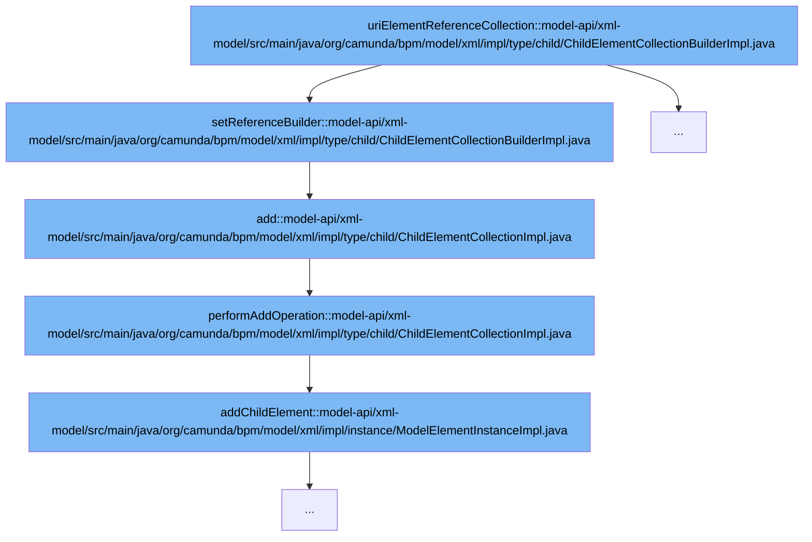

This document will cover the process of adding a child element to a model in the Camunda BPM platform. The process involves the following steps:

1. Setting the reference builder
2. Adding the element to the collection
3. Performing the add operation
4. Adding the child element to the model.



<SwmSnippet path="/model-api/xml-model/src/main/java/org/camunda/bpm/model/xml/impl/type/child/ChildElementCollectionBuilderImpl.java" line="114">

---

# Setting the Reference Builder

The `setReferenceBuilder` function is used to set the reference builder for the collection. It throws an exception if the collection already has a reference builder, ensuring that a collection can only have one reference.

```java
  protected void setReferenceBuilder(ElementReferenceCollectionBuilder<?, ?> referenceBuilder) {
    if (this.referenceBuilder != null) {
      throw new ModelException("An collection cannot have more than one reference");
    }
    this.referenceBuilder = referenceBuilder;
    modelBuildOperations.add(referenceBuilder);
  }
```

---

</SwmSnippet>

<SwmSnippet path="/model-api/xml-model/src/main/java/org/camunda/bpm/model/xml/impl/type/child/ChildElementCollectionImpl.java" line="182">

---

# Adding the Element to the Collection

The `add` function is used to add an element to the collection. It throws an exception if the collection is immutable, ensuring that elements can only be added to mutable collections.

```java
      public boolean add(T e) {
        if(!isMutable) {
          throw new UnsupportedModelOperationException("add()", "collection is immutable");
        }
        performAddOperation(modelElement, e);
        return true;
      }
```

---

</SwmSnippet>

<SwmSnippet path="/model-api/xml-model/src/main/java/org/camunda/bpm/model/xml/impl/type/child/ChildElementCollectionImpl.java" line="113">

---

# Performing the Add Operation

The `performAddOperation` function is used to perform the add operation. It adds the child element to the model element.

```java
  /** the "add" operation used by the collection */
  private void performAddOperation(ModelElementInstanceImpl modelElement, T e) {
    modelElement.addChildElement(e);
  }
```

---

</SwmSnippet>

<SwmSnippet path="/model-api/xml-model/src/main/java/org/camunda/bpm/model/xml/impl/instance/ModelElementInstanceImpl.java" line="286">

---

# Adding the Child Element to the Model

The `addChildElement` function is used to add the child element to the model. It ensures that the new child is an instance of `ModelElementInstanceImpl` and then inserts the new child after the appropriate element.

```java
  public void addChildElement(ModelElementInstance newChild) {
    ModelUtil.ensureInstanceOf(newChild, ModelElementInstanceImpl.class);
    ModelElementInstance elementToInsertAfter = findElementToInsertAfter(newChild);
    insertElementAfter(newChild, elementToInsertAfter);
  }
```

---

</SwmSnippet>

&nbsp;

*This is an auto-generated document by Swimm AI 🌊 and has not yet been verified by a human*

<SwmMeta version="3.0.0" repo-id="Z2l0aHViJTNBJTNBREVNTy1jYW11bmRhLWJwbS1wbGF0Zm9ybSUzQSUzQXN3aW1taW8=" repo-name="DEMO-camunda-bpm-platform"><sup>Powered by [Swimm](/)</sup></SwmMeta>
