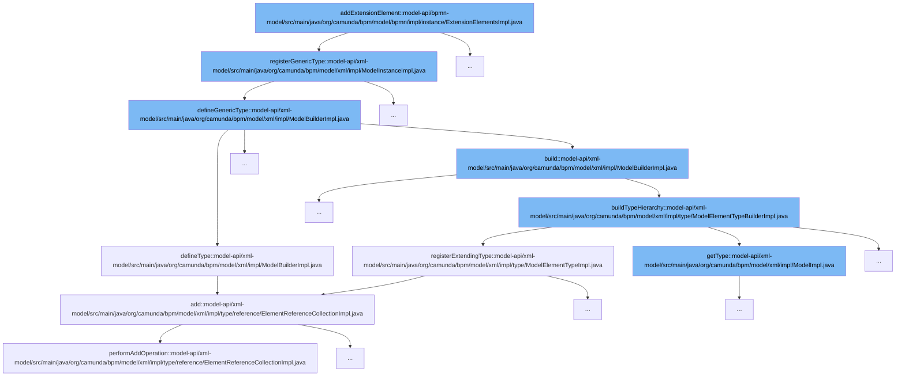

This document will cover the process of adding an extension element in the Camunda BPMN model, which includes:

1. Registering the generic type
2. Defining the generic type
3. Building the type hierarchy
4. Registering the extending type
5. Adding the element to the collection



<SwmSnippet path="/model-api/xml-model/src/main/java/org/camunda/bpm/model/xml/impl/ModelInstanceImpl.java" line="107">

---

# Registering the generic type

The function `registerGenericType` is used to register a new generic type in the model. If the type does not exist, it is defined and the model is built.

```java
  public ModelElementType registerGenericType(String namespaceUri, String localName) {
    ModelElementType elementType = model.getTypeForName(namespaceUri, localName);
    if (elementType == null) {
      elementType = modelBuilder.defineGenericType(localName, namespaceUri);
      model = (ModelImpl) modelBuilder.build();
    }
    return elementType;
  }
```

---

</SwmSnippet>

<SwmSnippet path="/model-api/xml-model/src/main/java/org/camunda/bpm/model/xml/impl/ModelBuilderImpl.java" line="59">

---

# Defining the generic type

The function `defineGenericType` is used to define a new generic type in the model. It creates a new instance of the type and builds it.

```java
  public ModelElementType defineGenericType(String typeName, String typeNamespaceUri) {
    ModelElementTypeBuilder typeBuilder = defineType(ModelElementInstance.class, typeName)
      .namespaceUri(typeNamespaceUri)
      .instanceProvider(new ModelTypeInstanceProvider<ModelElementInstance>() {
        public ModelElementInstance newInstance(ModelTypeInstanceContext instanceContext) {
          return new ModelElementInstanceImpl(instanceContext);
        }
      });

    return typeBuilder.build();
  }
```

---

</SwmSnippet>

<SwmSnippet path="/model-api/xml-model/src/main/java/org/camunda/bpm/model/xml/impl/type/ModelElementTypeBuilderImpl.java" line="121">

---

# Building the type hierarchy

The function `buildTypeHierarchy` is used to build the type hierarchy. If the extended type exists, it sets the base type and registers the extending type.

```java
  public void buildTypeHierarchy(Model model) {

    // build type hierarchy
    if(extendedType != null) {
      ModelElementTypeImpl extendedModelElementType = (ModelElementTypeImpl) model.getType(extendedType);
      if(extendedModelElementType == null) {
        throw new ModelException("Type "+modelType+" is defined to extend "+extendedType+" but no such type is defined.");

      } else {
        modelType.setBaseType(extendedModelElementType);
        extendedModelElementType.registerExtendingType(modelType);
      }
    }
  }
```

---

</SwmSnippet>

<SwmSnippet path="/model-api/xml-model/src/main/java/org/camunda/bpm/model/xml/impl/type/ModelElementTypeImpl.java" line="107">

---

# Registering the extending type

The function `registerExtendingType` is used to register an extending type in the model. If the type does not exist in the extending types, it is added.

```java
  public void registerExtendingType(ModelElementType modelType) {
    if (!extendingTypes.contains(modelType)) {
      extendingTypes.add(modelType);
    }
  }
```

---

</SwmSnippet>

<SwmSnippet path="/model-api/xml-model/src/main/java/org/camunda/bpm/model/xml/impl/type/reference/ElementReferenceCollectionImpl.java" line="173">

---

# Adding the element to the collection

The function `add` is used to add an element to the collection. If the collection is not immutable and does not contain the element, the `performAddOperation` function is called to add the element.

```java
      public boolean add(Target t) {
        if (referenceSourceCollection.isImmutable()) {
          throw new UnsupportedModelOperationException("add()", "collection is immutable");
        }
        else {
          if (!contains(t)) {
            performAddOperation(referenceSourceParentElement, t);
          }
          return true;
        }
      }
```

---

</SwmSnippet>

&nbsp;

*This is an auto-generated document by Swimm AI 🌊 and has not yet been verified by a human*

<SwmMeta version="3.0.0" repo-id="Z2l0aHViJTNBJTNBREVNTy1jYW11bmRhLWJwbS1wbGF0Zm9ybSUzQSUzQXN3aW1taW8=" repo-name="DEMO-camunda-bpm-platform"><sup>Powered by [Swimm](/)</sup></SwmMeta>
