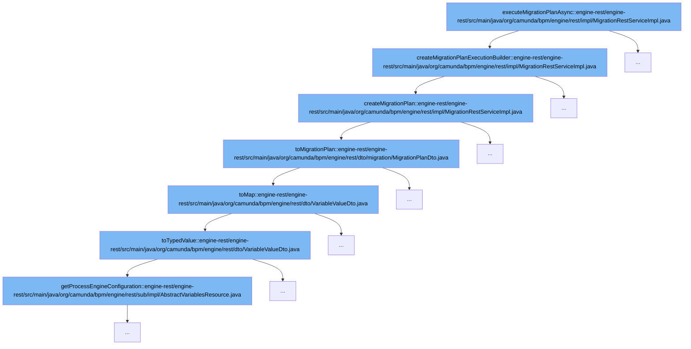

This document will cover the process of executing a migration plan asynchronously in the Camunda BPM platform. The process involves the following steps:

1. Creation of a Migration Plan Execution Builder
2. Creation of a Migration Plan
3. Conversion of the Migration Plan to a DTO
4. Conversion of Variable Values to a Map
5. Conversion of Variable Values to Typed Values
6. Retrieval of Process Engine Configuration.



<SwmSnippet path="/engine-rest/engine-rest/src/main/java/org/camunda/bpm/engine/rest/impl/MigrationRestServiceImpl.java" line="100">

---

# Creating a Migration Plan Execution Builder

The `createMigrationPlanExecutionBuilder` function is the first step in the process. It creates a Migration Plan Execution Builder, which is used to execute the migration plan. The function takes a `MigrationExecutionDto` as input and returns a `MigrationPlanExecutionBuilder`.

```java
  protected MigrationPlanExecutionBuilder createMigrationPlanExecutionBuilder(MigrationExecutionDto migrationExecution) {
    MigrationPlan migrationPlan = createMigrationPlan(migrationExecution.getMigrationPlan());
    List<String> processInstanceIds = migrationExecution.getProcessInstanceIds();

    MigrationPlanExecutionBuilder executionBuilder = getProcessEngine().getRuntimeService()
      .newMigration(migrationPlan).processInstanceIds(processInstanceIds);

    ProcessInstanceQueryDto processInstanceQueryDto = migrationExecution.getProcessInstanceQuery();
    if (processInstanceQueryDto != null) {
      ProcessInstanceQuery processInstanceQuery = processInstanceQueryDto.toQuery(getProcessEngine());
      executionBuilder.processInstanceQuery(processInstanceQuery);
    }

    if (migrationExecution.isSkipCustomListeners()) {
      executionBuilder.skipCustomListeners();
    }

    if (migrationExecution.isSkipIoMappings()) {
      executionBuilder.skipIoMappings();
    }

```

---

</SwmSnippet>

<SwmSnippet path="/engine-rest/engine-rest/src/main/java/org/camunda/bpm/engine/rest/impl/MigrationRestServiceImpl.java" line="124">

---

# Creating a Migration Plan

The `createMigrationPlan` function is the second step in the process. It creates a Migration Plan from a `MigrationPlanDto`. The function handles exceptions related to Migration Plan Validation and Bad User Requests.

```java
  protected MigrationPlan createMigrationPlan(MigrationPlanDto migrationPlanDto) {
    try {
      return MigrationPlanDto.toMigrationPlan(getProcessEngine(), objectMapper, migrationPlanDto);
    }
    catch (MigrationPlanValidationException e) {
      throw e;
    }
    catch (BadUserRequestException e) {
      throw new InvalidRequestException(Status.BAD_REQUEST, e, e.getMessage());
    }
  }
```

---

</SwmSnippet>

<SwmSnippet path="/engine-rest/engine-rest/src/main/java/org/camunda/bpm/engine/rest/dto/migration/MigrationPlanDto.java" line="94">

---

# Converting the Migration Plan to a DTO

The `toMigrationPlan` function converts the Migration Plan to a DTO (Data Transfer Object). This function is necessary to ensure that the Migration Plan can be easily transferred between processes.

```java
  public static MigrationPlan toMigrationPlan(ProcessEngine processEngine,
                                              ObjectMapper objectMapper,
                                              MigrationPlanDto migrationPlanDto) {
    MigrationPlanBuilder migrationPlanBuilder = processEngine.getRuntimeService().createMigrationPlan(migrationPlanDto.getSourceProcessDefinitionId(), migrationPlanDto.getTargetProcessDefinitionId());

    Map<String, VariableValueDto> variableDtos = migrationPlanDto.getVariables();
    if (variableDtos != null) {
      Map<String, Object> variables =
          VariableValueDto.toMap(variableDtos, processEngine, objectMapper);
      migrationPlanBuilder.setVariables(variables);
    }

    if (migrationPlanDto.getInstructions() != null) {
      for (MigrationInstructionDto migrationInstructionDto : migrationPlanDto.getInstructions()) {
        MigrationInstructionBuilder migrationInstructionBuilder = migrationPlanBuilder.mapActivities(migrationInstructionDto.getSourceActivityIds().get(0), migrationInstructionDto.getTargetActivityIds().get(0));
        if (Boolean.TRUE.equals(migrationInstructionDto.isUpdateEventTrigger())) {
          migrationInstructionBuilder = migrationInstructionBuilder.updateEventTrigger();
        }

        migrationPlanBuilder = migrationInstructionBuilder;
      }
```

---

</SwmSnippet>

<SwmSnippet path="/engine-rest/engine-rest/src/main/java/org/camunda/bpm/engine/rest/dto/VariableValueDto.java" line="147">

---

# Converting Variable Values to a Map

The `toMap` function converts variable values to a map. This is necessary for the process engine to understand and process the variable values.

```java
  public static VariableMap toMap(Map<String, VariableValueDto> variables, ProcessEngine processEngine, ObjectMapper objectMapper) {
    if(variables == null) {
      return null;
    }

    VariableMap result = Variables.createVariables();
    for (Entry<String, VariableValueDto> variableEntry : variables.entrySet()) {
      result.put(variableEntry.getKey(), variableEntry.getValue().toTypedValue(processEngine, objectMapper));
    }

    return result;
  }
```

---

</SwmSnippet>

<SwmSnippet path="/engine-rest/engine-rest/src/main/java/org/camunda/bpm/engine/rest/dto/VariableValueDto.java" line="83">

---

# Converting Variable Values to Typed Values

The `toTypedValue` function converts variable values to typed values. This is necessary for the process engine to understand and process the variable values in their correct types.

```java
  public TypedValue toTypedValue(ProcessEngine processEngine, ObjectMapper objectMapper) {
    ValueTypeResolver valueTypeResolver = processEngine.getProcessEngineConfiguration().getValueTypeResolver();

    if (type == null) {
      if (valueInfo != null && valueInfo.get(ValueType.VALUE_INFO_TRANSIENT) instanceof Boolean) {
        return Variables.untypedValue(value, (Boolean) valueInfo.get(ValueType.VALUE_INFO_TRANSIENT));
      }
      return Variables.untypedValue(value);
    }

    ValueType valueType = valueTypeResolver.typeForName(fromRestApiTypeName(type));
    if(valueType == null) {
      throw new RestException(Status.BAD_REQUEST, String.format("Unsupported value type '%s'", type));
    }
    else {
      if(valueType instanceof PrimitiveValueType) {
        PrimitiveValueType primitiveValueType = (PrimitiveValueType) valueType;
        Class<?> javaType = primitiveValueType.getJavaType();
        Object mappedValue = null;
        try {
          if(value != null) {
```

---

</SwmSnippet>

<SwmSnippet path="/engine-rest/engine-rest/src/main/java/org/camunda/bpm/engine/rest/sub/impl/AbstractVariablesResource.java" line="217">

---

# Retrieving Process Engine Configuration

The `getProcessEngineConfiguration` function retrieves the configuration of the process engine. This is necessary for the process engine to execute the migration plan according to its configuration.

```java
  protected ProcessEngineConfiguration getProcessEngineConfiguration() {
    return engine.getProcessEngineConfiguration();
  }
```

---

</SwmSnippet>

&nbsp;

*This is an auto-generated document by Swimm AI 🌊 and has not yet been verified by a human*

<SwmMeta version="3.0.0" repo-id="Z2l0aHViJTNBJTNBREVNTy1jYW11bmRhLWJwbS1wbGF0Zm9ybSUzQSUzQXN3aW1taW8=" repo-name="DEMO-camunda-bpm-platform"><sup>Powered by [Swimm](/)</sup></SwmMeta>
