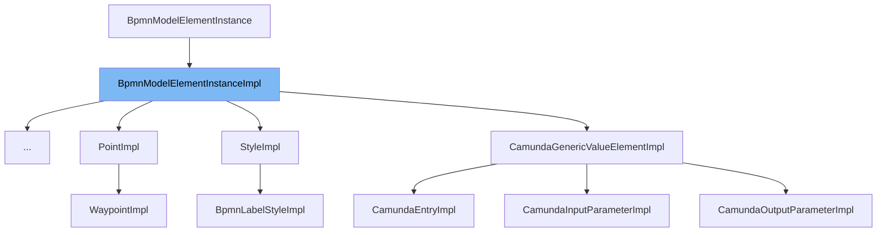

This document will cover the `BpmnModelElementInstanceImpl` class. We'll cover:

1. What is `BpmnModelElementInstanceImpl`.
2. Variables and functions in `BpmnModelElementInstanceImpl`.
3. Usage example of `BpmnModelElementInstanceImpl`.



# What is BpmnModelElementInstanceImpl

`BpmnModelElementInstanceImpl` is a shared base class for all BPMN Model Elements. It provides implementation of the `BpmnModelElementInstance` interface. This class is part of the Camunda BPMN model and is used to represent BPMN elements in the model.

<SwmSnippet path="/model-api/bpmn-model/src/main/java/org/camunda/bpm/model/bpmn/impl/instance/BpmnModelElementInstanceImpl.java" line="34">

---

# Variables and functions

The constructor `BpmnModelElementInstanceImpl` is used to create an instance of `BpmnModelElementInstanceImpl` with a given `ModelTypeInstanceContext`.

```java
  public BpmnModelElementInstanceImpl(ModelTypeInstanceContext instanceContext) {
    super(instanceContext);
  }
```

---

</SwmSnippet>

<SwmSnippet path="/model-api/bpmn-model/src/main/java/org/camunda/bpm/model/bpmn/impl/instance/BpmnModelElementInstanceImpl.java" line="39">

---

The function `builder` is used to create a builder for the BPMN model element. If no builder is implemented, it throws a `BpmnModelException`.

```java
  public AbstractBaseElementBuilder builder() {
    throw new BpmnModelException("No builder implemented for " + this);
  }
```

---

</SwmSnippet>

<SwmSnippet path="/model-api/bpmn-model/src/main/java/org/camunda/bpm/model/bpmn/impl/instance/BpmnModelElementInstanceImpl.java" line="43">

---

The function `isScope` checks if the current instance is a process or a subprocess.

```java
  public boolean isScope() {
    return this instanceof org.camunda.bpm.model.bpmn.instance.Process || this instanceof SubProcess;
  }
```

---

</SwmSnippet>

<SwmSnippet path="/model-api/bpmn-model/src/main/java/org/camunda/bpm/model/bpmn/impl/instance/BpmnModelElementInstanceImpl.java" line="47">

---

The function `getScope` retrieves the scope of the current BPMN model element. It checks if the parent element is a scope, if not, it recursively checks the parent's scope.

```java
  public BpmnModelElementInstance getScope() {
    BpmnModelElementInstance parentElement = (BpmnModelElementInstance) getParentElement();
    if (parentElement != null) {
      if (parentElement.isScope()) {
        return parentElement;
      }
      else {
        return parentElement.getScope();
      }
    }
    else {
      return null;
    }
  }
```

---

</SwmSnippet>

<SwmSnippet path="/model-api/bpmn-model/src/main/java/org/camunda/bpm/model/bpmn/impl/instance/LoopDataOutputRef.java" line="32">

---

# Usage example

`LoopDataOutputRef` is an example of a class that extends `BpmnModelElementInstanceImpl`. It represents the BPMN 2.0 loopDataOutputRef element of the BPMN 2.0 tMultiInstanceLoopCharacteristics type.

```java
public class LoopDataOutputRef extends BpmnModelElementInstanceImpl {

  public static void registerType(ModelBuilder modelBuilder) {
    ModelElementTypeBuilder typeBuilder = modelBuilder
      .defineType(LoopDataOutputRef.class, BPMN_ELEMENT_LOOP_DATA_OUTPUT_REF)
      .namespaceUri(BPMN20_NS)
      .instanceProvider(
        new ModelElementTypeBuilder.ModelTypeInstanceProvider<LoopDataOutputRef>() {
          public LoopDataOutputRef newInstance(ModelTypeInstanceContext instanceContext) {
            return new LoopDataOutputRef(instanceContext);
          }
        });

    typeBuilder.build();
  }

  public LoopDataOutputRef(ModelTypeInstanceContext instanceContext) {
    super(instanceContext);
  }
}
```

---

</SwmSnippet>

&nbsp;

*This is an auto-generated document by Swimm AI 🌊 and has not yet been verified by a human*

<SwmMeta version="3.0.0" repo-id="Z2l0aHViJTNBJTNBREVNTy1jYW11bmRhLWJwbS1wbGF0Zm9ybSUzQSUzQXN3aW1taW8=" repo-name="DEMO-camunda-bpm-platform"><sup>Powered by [Swimm](/)</sup></SwmMeta>
