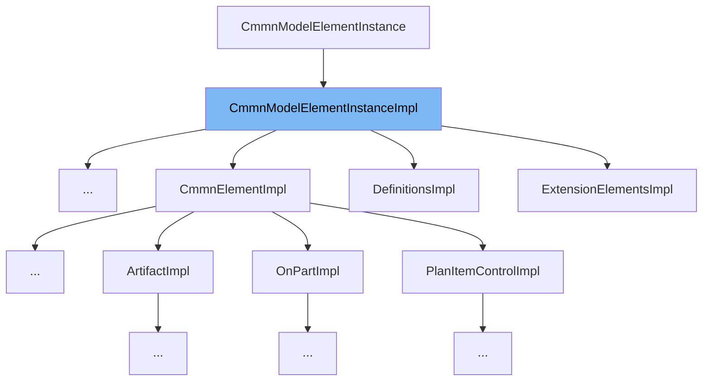

This document will cover the `CmmnModelElementInstanceImpl` class. We'll cover:

1. What `CmmnModelElementInstanceImpl` is and its purpose.
2. The variables and functions defined in `CmmnModelElementInstanceImpl`.
3. An example of how to use `CmmnModelElementInstanceImpl` in `CamundaInImpl`.

&nbsp;

*This is an auto-generated document by Swimm AI 🌊 and has not yet been verified by a human*

<SwmMeta version="3.0.0" repo-id="Z2l0aHViJTNBJTNBREVNTy1jYW11bmRhLWJwbS1wbGF0Zm9ybSUzQSUzQXN3aW1taW8=" repo-name="DEMO-camunda-bpm-platform">Powered by [Swimm](/)</SwmMeta>
