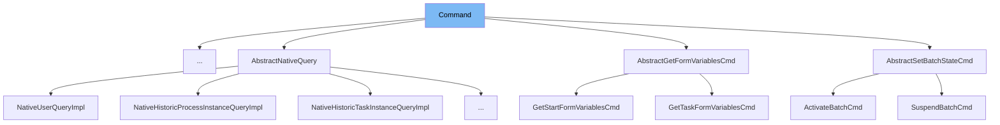

This document will cover the following aspects of the `Command` class in the Camunda BPM platform:

1. What is `Command`
2. Variables and functions in `Command`
3. Usage example of `Command`



# What is Command

`Command` is an interface in the Camunda BPM platform, located in the `org.camunda.bpm.engine.impl.interceptor` package. It represents a command that can be executed within a `CommandContext`. The `Command` interface is a key part of the command pattern used in the Camunda BPM platform, which encapsulates a request as an object, thereby allowing users to parameterize clients with queues, requests, operations, and also allows operations to be undone.

# Variables and functions

`Command` does not have any variables as it is an interface. However, it defines two methods: `execute` and `isRetryable`.

<SwmSnippet path="/engine/src/main/java/org/camunda/bpm/engine/impl/interceptor/Command.java" line="26">

---

## The `execute` function

The `execute` method is the main method of the `Command` interface. It takes a `CommandContext` as a parameter and returns a generic type `T`. This method is meant to be overridden by classes implementing the `Command` interface, and it contains the logic of the command to be executed.

```java
  T execute(CommandContext commandContext);
```

---

</SwmSnippet>

<SwmSnippet path="/engine/src/main/java/org/camunda/bpm/engine/impl/interceptor/Command.java" line="33">

---

## The `isRetryable` function

The `isRetryable` method is a default method of the `Command` interface. It returns a boolean indicating whether the command can be retried upon failure with a `CrdbTransactionRetryException`. By default, it returns `false`, but it can be overridden by classes implementing the `Command` interface to provide custom retry logic.

```java
  default boolean isRetryable() {
    return false;
  }
```

---

</SwmSnippet>

&nbsp;

*This is an auto-generated document by Swimm AI 🌊 and has not yet been verified by a human*

<SwmMeta version="3.0.0" repo-id="Z2l0aHViJTNBJTNBREVNTy1jYW11bmRhLWJwbS1wbGF0Zm9ybSUzQSUzQXN3aW1taW8=" repo-name="DEMO-camunda-bpm-platform"><sup>Powered by [Swimm](/)</sup></SwmMeta>
