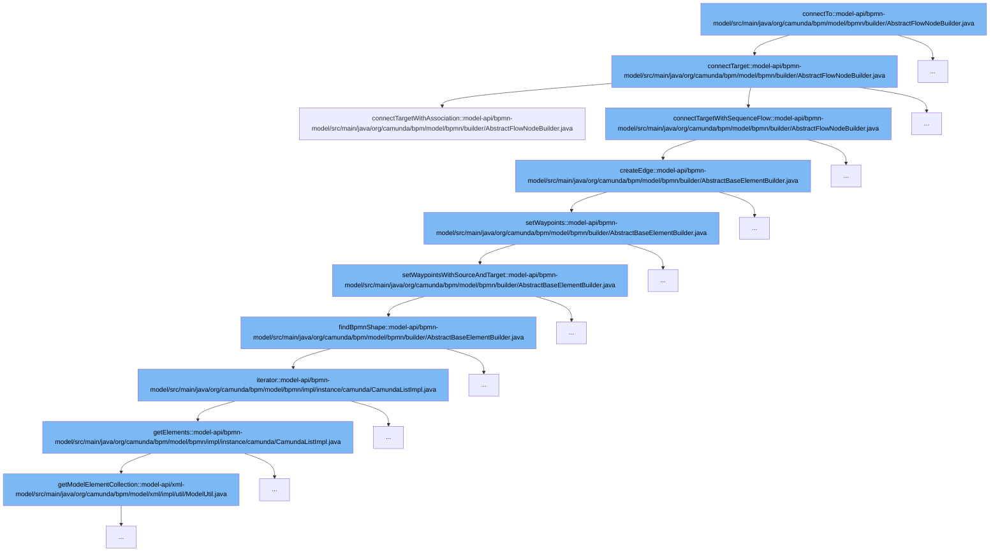

This document will cover the process of connecting nodes in the BPMN model, which includes:

1. Initiating the connection
2. Determining the type of connection
3. Creating the connection edge
4. Setting waypoints for the connection
5. Finding the BPMN shape for the connection



<SwmSnippet path="/model-api/bpmn-model/src/main/java/org/camunda/bpm/model/bpmn/builder/AbstractFlowNodeBuilder.java" line="60">

---

# Initiating the Connection

The `connectTo` function initiates the process of connecting nodes. It checks if compensation was started and based on the type of target node, it decides how to connect the target.

```java
  protected void connectTarget(FlowNode target) {
    // check if compensation was started
    if (isBoundaryEventWithStartedCompensation()) {
        // the target activity should be marked for compensation
        if (target instanceof Activity) {
          ((Activity) target).setForCompensation(true);
        }

        // connect the target via association instead of sequence flow
        connectTargetWithAssociation(target);
    }
    else if (isCompensationHandler()) {
      // cannot connect to a compensation handler
      throw new BpmnModelException("Only single compensation handler allowed. Call compensationDone() to continue main flow.");
    }
    else {
      // connect as sequence flow by default
      connectTargetWithSequenceFlow(target);
    }
  }
```

---

</SwmSnippet>

<SwmSnippet path="/model-api/bpmn-model/src/main/java/org/camunda/bpm/model/bpmn/builder/AbstractBaseElementBuilder.java" line="372">

---

# Creating the Connection Edge

The `createEdge` function creates an edge for the connection. It sets the waypoints for the edge and adds it to the BPMN plane.

```java
  public BpmnEdge createEdge(BaseElement baseElement) {
    BpmnPlane bpmnPlane = findBpmnPlane();
    if (bpmnPlane != null) {


       BpmnEdge edge = createInstance(BpmnEdge.class);
       edge.setBpmnElement(baseElement);
       setWaypoints(edge);

       bpmnPlane.addChildElement(edge);
       return edge;
    }
    return null;

  }
```

---

</SwmSnippet>

<SwmSnippet path="/model-api/bpmn-model/src/main/java/org/camunda/bpm/model/bpmn/builder/AbstractBaseElementBuilder.java" line="388">

---

# Setting Waypoints for the Connection

The `setWaypoints` function sets the waypoints for the edge. It determines the source and target of the edge based on the type of BPMN element and calls `setWaypointsWithSourceAndTarget` to set the waypoints.

```java
  protected void setWaypoints(BpmnEdge edge) {
    BaseElement bpmnElement = edge.getBpmnElement();

    FlowNode edgeSource;
    FlowNode edgeTarget;
    if (bpmnElement instanceof SequenceFlow) {

      SequenceFlow sequenceFlow = (SequenceFlow) bpmnElement;

      edgeSource = sequenceFlow.getSource();
      edgeTarget = sequenceFlow.getTarget();

    } else if (bpmnElement instanceof Association){
      Association association = (Association) bpmnElement;

      edgeSource = (FlowNode) association.getSource();
      edgeTarget = (FlowNode) association.getTarget();
    } else {
      throw new RuntimeException("Bpmn element type not supported");
    }

```

---

</SwmSnippet>

<SwmSnippet path="/model-api/bpmn-model/src/main/java/org/camunda/bpm/model/bpmn/builder/AbstractBaseElementBuilder.java" line="463">

---

# Finding the BPMN Shape for the Connection

The `findBpmnShape` function finds the BPMN shape for a given node. It iterates over all shapes in the model instance and returns the shape that matches the node.

```java
  protected BpmnShape findBpmnShape(BaseElement node) {
    Collection<BpmnShape> allShapes = modelInstance.getModelElementsByType(BpmnShape.class);

    Iterator<BpmnShape> iterator = allShapes.iterator();
    while (iterator.hasNext()) {
      BpmnShape shape = iterator.next();
      if (shape.getBpmnElement().equals(node)) {
        return shape;
      }
    }
    return null;
  }
```

---

</SwmSnippet>

&nbsp;

*This is an auto-generated document by Swimm AI 🌊 and has not yet been verified by a human*

<SwmMeta version="3.0.0" repo-id="Z2l0aHViJTNBJTNBREVNTy1jYW11bmRhLWJwbS1wbGF0Zm9ybSUzQSUzQXN3aW1taW8=" repo-name="DEMO-camunda-bpm-platform"><sup>Powered by [Swimm](/)</sup></SwmMeta>
