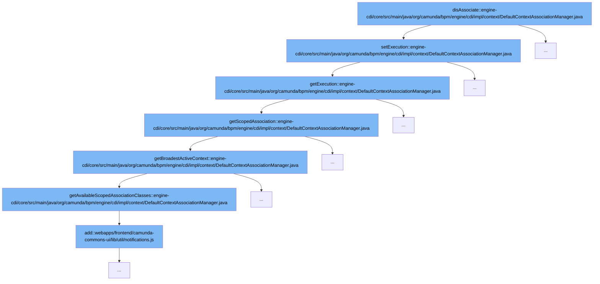

This document will cover the process of disassociating an execution context in the Camunda BPM platform. The steps include:

1. Initiating the disassociation
2. Setting the execution context
3. Retrieving the execution context
4. Getting the scoped association
5. Determining the broadest active context
6. Getting available scoped association classes.



<SwmSnippet path="/engine-cdi/core/src/main/java/org/camunda/bpm/engine/cdi/impl/context/DefaultContextAssociationManager.java" line="98">

---

# Initiating the disassociation

The `disAssociate` function initiates the disassociation process. It first checks if the execution context is null and throws an exception if it is. Then it ensures that the command context is not active before proceeding to get the scoped association and the associated execution. If an execution is already associated, it throws an exception.

```java
  @Override
  public void setExecution(Execution execution) {
    if(execution == null) {
      throw new ProcessEngineCdiException("Cannot associate with execution: null");
    }
    ensureCommandContextNotActive();

    ScopedAssociation scopedAssociation = getScopedAssociation();
    Execution associatedExecution = scopedAssociation.getExecution();
    if(associatedExecution!=null && !associatedExecution.getId().equals(execution.getId())) {
      throw new ProcessEngineCdiException("Cannot associate "+execution+", already associated with "+associatedExecution+". Disassociate first!");
    }

    if (log.isLoggable(Level.FINE)) {
      log.fine("Associating "+execution+" (@"
                + scopedAssociation.getClass().getAnnotations()[0].annotationType().getSimpleName() + ")");
    }
    scopedAssociation.setExecution(execution);
  }
```

---

</SwmSnippet>

<SwmSnippet path="/engine-cdi/core/src/main/java/org/camunda/bpm/engine/cdi/impl/context/DefaultContextAssociationManager.java" line="98">

---

# Setting the execution context

The `setExecution` function is called to set the execution context. It checks if the execution context is null and throws an exception if it is. Then it ensures that the command context is not active before proceeding to get the scoped association and the associated execution. If an execution is already associated, it throws an exception.

```java
  @Override
  public void setExecution(Execution execution) {
    if(execution == null) {
      throw new ProcessEngineCdiException("Cannot associate with execution: null");
    }
    ensureCommandContextNotActive();

    ScopedAssociation scopedAssociation = getScopedAssociation();
    Execution associatedExecution = scopedAssociation.getExecution();
    if(associatedExecution!=null && !associatedExecution.getId().equals(execution.getId())) {
      throw new ProcessEngineCdiException("Cannot associate "+execution+", already associated with "+associatedExecution+". Disassociate first!");
    }

    if (log.isLoggable(Level.FINE)) {
      log.fine("Associating "+execution+" (@"
                + scopedAssociation.getClass().getAnnotations()[0].annotationType().getSimpleName() + ")");
    }
    scopedAssociation.setExecution(execution);
  }
```

---

</SwmSnippet>

<SwmSnippet path="/engine-cdi/core/src/main/java/org/camunda/bpm/engine/cdi/impl/context/DefaultContextAssociationManager.java" line="144">

---

# Retrieving the execution context

The `getExecution` function is used to retrieve the execution context. It first tries to get the execution from the context. If it's not available, it gets the execution from the scoped association.

```java
  @Override
  public Execution getExecution() {
    ExecutionEntity execution = getExecutionFromContext();
    if(execution != null) {
      return execution;
    } else {
      return getScopedAssociation().getExecution();
    }
  }
```

---

</SwmSnippet>

<SwmSnippet path="/engine-cdi/core/src/main/java/org/camunda/bpm/engine/cdi/impl/context/DefaultContextAssociationManager.java" line="94">

---

# Getting the scoped association

The `getScopedAssociation` function is used to get the scoped association. It does this by looking up the broadest active context.

```java
  protected ScopedAssociation getScopedAssociation() {
    return ProgrammaticBeanLookup.lookup(getBroadestActiveContext(), beanManager);
  }
```

---

</SwmSnippet>

<SwmSnippet path="/engine-cdi/core/src/main/java/org/camunda/bpm/engine/cdi/impl/context/DefaultContextAssociationManager.java" line="64">

---

# Determining the broadest active context

The `getBroadestActiveContext` function is used to determine the broadest active context. It does this by iterating over the available scoped association classes and checking if they are active. If none are active, it throws an exception.

```java
  protected Class< ? extends ScopedAssociation> getBroadestActiveContext() {
    for (Class< ? extends ScopedAssociation> scopeType : getAvailableScopedAssociationClasses()) {
      Annotation scopeAnnotation = scopeType.getAnnotations().length > 0 ? scopeType.getAnnotations()[0] : null;
      if (scopeAnnotation == null || !beanManager.isScope(scopeAnnotation.annotationType())) {
        throw new ProcessEngineException("ScopedAssociation must carry exactly one annotation and it must be a @Scope annotation");
      }
      try {
        beanManager.getContext(scopeAnnotation.annotationType());
        return scopeType;
      } catch (ContextNotActiveException e) {
        log.finest("Context " + scopeAnnotation.annotationType() + " not active.");
      }
    }
    throw new ProcessEngineException("Could not determine an active context to associate the current process instance / task instance with.");
  }
```

---

</SwmSnippet>

<SwmSnippet path="/engine-cdi/core/src/main/java/org/camunda/bpm/engine/cdi/impl/context/DefaultContextAssociationManager.java" line="80">

---

# Getting available scoped association classes

The `getAvailableScopedAssociationClasses` function is used to get the available scoped association classes. It returns a list of scope types which are used to resolve the broadest active context.

```java
  /**
   * Override to add different / additional contexts.
   *
   * @returns a list of {@link Scope}-types, which are used in the given order
   *          to resolve the broadest active context (@link
   *          #getBroadestActiveContext()})
   */
  protected List<Class< ? extends ScopedAssociation>> getAvailableScopedAssociationClasses() {
    ArrayList<Class< ? extends ScopedAssociation>> scopeTypes = new ArrayList<Class< ? extends ScopedAssociation>>();
    scopeTypes.add(ConversationScopedAssociation.class);
    scopeTypes.add(RequestScopedAssociation.class);
    return scopeTypes;
  }
```

---

</SwmSnippet>

&nbsp;

*This is an auto-generated document by Swimm AI 🌊 and has not yet been verified by a human*

<SwmMeta version="3.0.0" repo-id="Z2l0aHViJTNBJTNBREVNTy1jYW11bmRhLWJwbS1wbGF0Zm9ybSUzQSUzQXN3aW1taW8=" repo-name="DEMO-camunda-bpm-platform"><sup>Powered by [Swimm](/)</sup></SwmMeta>
