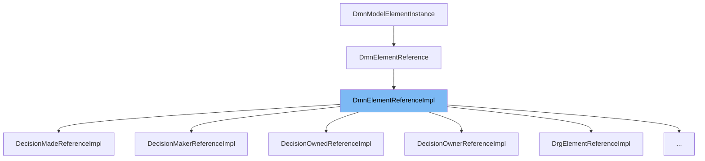

This document will cover the `DmnElementReferenceImpl` class. We'll cover:

1. What `DmnElementReferenceImpl` is and its purpose.
2. The variables and functions defined in `DmnElementReferenceImpl`.
3. An example of how to use `DmnElementReferenceImpl`.

# What is DmnElementReferenceImpl

`DmnElementReferenceImpl` is a class in the Camunda BPM platform that represents a reference to a DMN (Decision Model and Notation) element. It is used to store and manage the reference to a DMN element in the DMN model.

&nbsp;

*This is an auto-generated document by Swimm AI 🌊 and has not yet been verified by a human*

<SwmMeta version="3.0.0" repo-id="Z2l0aHViJTNBJTNBREVNTy1jYW11bmRhLWJwbS1wbGF0Zm9ybSUzQSUzQXN3aW1taW8=" repo-name="DEMO-camunda-bpm-platform">Powered by [Swimm](/)</SwmMeta>
