This document will cover the process of executing a list of tasks in the Camunda BPM platform, which includes:

1. Executing the list
2. Querying the list
3. Converting the list to a HAL collection
4. Embedding variable values in the HAL task
5. Generating variable values

```mermaid
graph TD;
  executeList::engine-rest/engine-rest/src/main/java/org/camunda/bpm/engine/rest/sub/runtime/impl/FilterResourceImpl.java:::mainFlowStyle --> executeHalList::engine-rest/engine-rest/src/main/java/org/camunda/bpm/engine/rest/sub/runtime/impl/FilterResourceImpl.java
  executeList::engine-rest/engine-rest/src/main/java/org/camunda/bpm/engine/rest/sub/runtime/impl/FilterResourceImpl.java:::mainFlowStyle --> dkl5u[...]
  executeHalList::engine-rest/engine-rest/src/main/java/org/camunda/bpm/engine/rest/sub/runtime/impl/FilterResourceImpl.java:::mainFlowStyle --> queryHalList::engine-rest/engine-rest/src/main/java/org/camunda/bpm/engine/rest/sub/runtime/impl/FilterResourceImpl.java
  queryHalList::engine-rest/engine-rest/src/main/java/org/camunda/bpm/engine/rest/sub/runtime/impl/FilterResourceImpl.java:::mainFlowStyle --> convertToHalCollection::engine-rest/engine-rest/src/main/java/org/camunda/bpm/engine/rest/sub/runtime/impl/FilterResourceImpl.java
  queryHalList::engine-rest/engine-rest/src/main/java/org/camunda/bpm/engine/rest/sub/runtime/impl/FilterResourceImpl.java:::mainFlowStyle --> h68q3[...]
  convertToHalCollection::engine-rest/engine-rest/src/main/java/org/camunda/bpm/engine/rest/sub/runtime/impl/FilterResourceImpl.java:::mainFlowStyle --> convertToHalTaskList::engine-rest/engine-rest/src/main/java/org/camunda/bpm/engine/rest/sub/runtime/impl/FilterResourceImpl.java
  convertToHalCollection::engine-rest/engine-rest/src/main/java/org/camunda/bpm/engine/rest/sub/runtime/impl/FilterResourceImpl.java:::mainFlowStyle --> 713me[...]
  convertToHalTaskList::engine-rest/engine-rest/src/main/java/org/camunda/bpm/engine/rest/sub/runtime/impl/FilterResourceImpl.java:::mainFlowStyle --> generate::engine-rest/engine-rest/src/main/java/org/camunda/bpm/engine/rest/hal/task/HalTaskList.java
  convertToHalTaskList::engine-rest/engine-rest/src/main/java/org/camunda/bpm/engine/rest/sub/runtime/impl/FilterResourceImpl.java:::mainFlowStyle --> embedVariableValuesInHalTask::engine-rest/engine-rest/src/main/java/org/camunda/bpm/engine/rest/sub/runtime/impl/FilterResourceImpl.java
  convertToHalTaskList::engine-rest/engine-rest/src/main/java/org/camunda/bpm/engine/rest/sub/runtime/impl/FilterResourceImpl.java:::mainFlowStyle --> tkkv9[...]
  generate::engine-rest/engine-rest/src/main/java/org/camunda/bpm/engine/rest/hal/task/HalTaskList.java --> fromTaskList::engine-rest/engine-rest/src/main/java/org/camunda/bpm/engine/rest/hal/task/HalTaskList.java
  generate::engine-rest/engine-rest/src/main/java/org/camunda/bpm/engine/rest/hal/task/HalTaskList.java --> embed::engine-rest/engine-rest/src/main/java/org/camunda/bpm/engine/rest/hal/HalResource.java
  fromTaskList::engine-rest/engine-rest/src/main/java/org/camunda/bpm/engine/rest/hal/task/HalTaskList.java --> fromTask::engine-rest/engine-rest/src/main/java/org/camunda/bpm/engine/rest/hal/task/HalTask.java
  fromTaskList::engine-rest/engine-rest/src/main/java/org/camunda/bpm/engine/rest/hal/task/HalTaskList.java --> addEmbedded::engine-rest/engine-rest/src/main/java/org/camunda/bpm/engine/rest/hal/HalResource.java
  fromTaskList::engine-rest/engine-rest/src/main/java/org/camunda/bpm/engine/rest/hal/task/HalTaskList.java --> tgckw[...]
  embed::engine-rest/engine-rest/src/main/java/org/camunda/bpm/engine/rest/hal/HalResource.java --> addEmbedded::engine-rest/engine-rest/src/main/java/org/camunda/bpm/engine/rest/hal/HalResource.java
  embed::engine-rest/engine-rest/src/main/java/org/camunda/bpm/engine/rest/hal/HalResource.java --> w0hse[...]
  embedVariableValuesInHalTask::engine-rest/engine-rest/src/main/java/org/camunda/bpm/engine/rest/sub/runtime/impl/FilterResourceImpl.java:::mainFlowStyle --> getVariableValuesForTask::engine-rest/engine-rest/src/main/java/org/camunda/bpm/engine/rest/sub/runtime/impl/FilterResourceImpl.java
  embedVariableValuesInHalTask::engine-rest/engine-rest/src/main/java/org/camunda/bpm/engine/rest/sub/runtime/impl/FilterResourceImpl.java:::mainFlowStyle --> x1h1v[...]
  getVariableValuesForTask::engine-rest/engine-rest/src/main/java/org/camunda/bpm/engine/rest/sub/runtime/impl/FilterResourceImpl.java:::mainFlowStyle --> generateVariableValue::engine-rest/engine-rest/src/main/java/org/camunda/bpm/engine/rest/hal/HalVariableValue.java
  getVariableValuesForTask::engine-rest/engine-rest/src/main/java/org/camunda/bpm/engine/rest/sub/runtime/impl/FilterResourceImpl.java:::mainFlowStyle --> miftd[...]
  generateVariableValue::engine-rest/engine-rest/src/main/java/org/camunda/bpm/engine/rest/hal/HalVariableValue.java:::mainFlowStyle --> generateCaseExecutionVariableValue::engine-rest/engine-rest/src/main/java/org/camunda/bpm/engine/rest/hal/HalVariableValue.java
  generateVariableValue::engine-rest/engine-rest/src/main/java/org/camunda/bpm/engine/rest/hal/HalVariableValue.java:::mainFlowStyle --> 211jp[...]
  generateCaseExecutionVariableValue::engine-rest/engine-rest/src/main/java/org/camunda/bpm/engine/rest/hal/HalVariableValue.java:::mainFlowStyle --> link::engine-rest/engine-rest/src/main/java/org/camunda/bpm/engine/rest/hal/HalVariableValue.java
  generateCaseExecutionVariableValue::engine-rest/engine-rest/src/main/java/org/camunda/bpm/engine/rest/hal/HalVariableValue.java:::mainFlowStyle --> cn9wa[...]
  link::engine-rest/engine-rest/src/main/java/org/camunda/bpm/engine/rest/hal/HalVariableValue.java:::mainFlowStyle --> ...

 classDef mainFlowStyle color:#000000,fill:#7CB9F4
```



<SwmSnippet path="/engine-rest/engine-rest/src/main/java/org/camunda/bpm/engine/rest/sub/runtime/impl/FilterResourceImpl.java" line="249">

---

# Executing the list

The `executeHalList` function is the entry point for executing a list of tasks. It calls the `queryHalList` function with the parameters `firstResult` and `maxResults`.

```java
  public HalResource executeHalList(Integer firstResult, Integer maxResults) {
    return queryHalList(null, firstResult, maxResults);
  }
```

---

</SwmSnippet>

<SwmSnippet path="/engine-rest/engine-rest/src/main/java/org/camunda/bpm/engine/rest/sub/runtime/impl/FilterResourceImpl.java" line="253">

---

# Querying the list

The `queryHalList` function executes the filter list and counts the results. If there are entities in the list, it converts them to a HAL collection.

```java
  public HalResource queryHalList(String extendingQuery, Integer firstResult, Integer maxResults) {
    List<?> entities = executeFilterList(extendingQuery, firstResult, maxResults);
    long count = executeFilterCount(extendingQuery);

    if (entities != null && !entities.isEmpty()) {
      return convertToHalCollection(entities, count);
    }
    else {
      return new EmptyHalCollection(count);
    }
  }
```

---

</SwmSnippet>

<SwmSnippet path="/engine-rest/engine-rest/src/main/java/org/camunda/bpm/engine/rest/sub/runtime/impl/FilterResourceImpl.java" line="393">

---

# Converting the list to a HAL collection

The `convertToHalCollection` function checks if the entities are of the `Task` class. If they are, it converts them to a HAL task list.

```java
  @SuppressWarnings("unchecked")
  protected HalCollectionResource convertToHalCollection(List<?> entities, long count) {
    if (isEntityOfClass(entities.get(0), Task.class)) {
      return convertToHalTaskList((List<Task>) entities, count);
    } else {
      throw unsupportedEntityClass(entities.get(0));
    }
  }
```

---

</SwmSnippet>

<SwmSnippet path="/engine-rest/engine-rest/src/main/java/org/camunda/bpm/engine/rest/sub/runtime/impl/FilterResourceImpl.java" line="402">

---

# Embedding variable values in the HAL task

The `convertToHalTaskList` function generates a HAL task list and gets the variable instances for the tasks. It then embeds the variable values in the HAL task.

```java
  @SuppressWarnings("unchecked")
  protected HalTaskList convertToHalTaskList(List<Task> tasks, long count) {
    HalTaskList halTasks = HalTaskList.generate(tasks, count, getProcessEngine());
    Map<String, List<VariableInstance>> variableInstances = getVariableInstancesForTasks(halTasks);
    if (variableInstances != null) {
      for (HalTask halTask : (List<HalTask>) halTasks.getEmbedded("task")) {
        embedVariableValuesInHalTask(halTask, variableInstances);
      }
    }
    return halTasks;
  }
```

---

</SwmSnippet>

<SwmSnippet path="/engine-rest/engine-rest/src/main/java/org/camunda/bpm/engine/rest/sub/runtime/impl/FilterResourceImpl.java" line="431">

---

# Generating variable values

The `getVariableValuesForTask` function gets the variable values for a task. It checks the variable scope ids and converts the variable instances to HAL variable values.

```java
  protected List<HalResource<?>> getVariableValuesForTask(HalTask halTask, Map<String, List<VariableInstance>> variableInstances) {
    // converted variables values
    List<HalResource<?>> variableValues = new ArrayList<>();

    // variable scope ids to check, ordered by visibility
    LinkedHashSet<String> variableScopeIds = getVariableScopeIds(halTask);

    // names of already converted variables
    Set<String> knownVariableNames = new HashSet<>();

    for (String variableScopeId : variableScopeIds) {
      if (variableInstances.containsKey(variableScopeId)) {
        for (VariableInstance variableInstance : variableInstances.get(variableScopeId)) {
          if (!knownVariableNames.contains(variableInstance.getName())) {
            variableValues.add(HalVariableValue.generateVariableValue(variableInstance, variableScopeId));
            knownVariableNames.add(variableInstance.getName());
          }
        }
      }
    }

```

---

</SwmSnippet>

&nbsp;

*This is an auto-generated document by Swimm AI 🌊 and has not yet been verified by a human*

<SwmMeta version="3.0.0" repo-id="Z2l0aHViJTNBJTNBREVNTy1jYW11bmRhLWJwbS1wbGF0Zm9ybSUzQSUzQXN3aW1taW8=" repo-name="DEMO-camunda-bpm-platform"><sup>Powered by [Swimm](/)</sup></SwmMeta>
