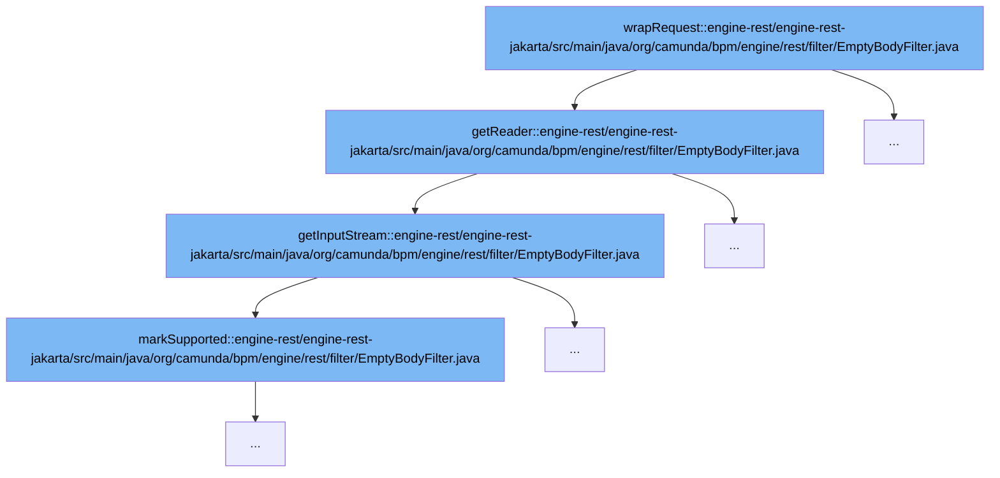

This document will cover the process of handling empty HTTP requests in the Camunda BPM platform, which includes:

1. Wrapping the request
2. Reading the request body
3. Checking if the request body supports marking



<SwmSnippet path="/engine-rest/engine-rest-jakarta/src/main/java/org/camunda/bpm/engine/rest/filter/EmptyBodyFilter.java" line="94">

---

# Wrapping the Request

The `wrapRequest` function is the entry point for this process. It wraps the incoming HTTP request and prepares it for further processing.

```java
      @Override
      public BufferedReader getReader() throws IOException {
        return EmptyBodyFilter.this.getReader(this.getInputStream());
      }
```

---

</SwmSnippet>

<SwmSnippet path="/engine-rest/engine-rest-jakarta/src/main/java/org/camunda/bpm/engine/rest/filter/EmptyBodyFilter.java" line="34">

---

# Reading the Request Body

The `getReader` function is called within `wrapRequest`. It reads the body of the HTTP request by calling `getInputStream`. The `getInputStream` function creates a new `ServletInputStream` which reads the request body into an `InputStream`.

```java
      @Override
      public ServletInputStream getInputStream() throws IOException {

        return new ServletInputStream() {

          final InputStream inputStream = getRequestBody(isBodyEmpty, requestBody);
          boolean finished = false;

          @Override
          public boolean isFinished() {
            return this.finished;
          }

          @Override
          public boolean isReady() {
            return true;
          }

          @Override
          public void setReadListener(final ReadListener readListener) {
            throw new UnsupportedOperationException();
```

---

</SwmSnippet>

<SwmSnippet path="/engine-rest/engine-rest-jakarta/src/main/java/org/camunda/bpm/engine/rest/filter/EmptyBodyFilter.java" line="86">

---

# Checking if the Request Body Supports Marking

The `markSupported` function is called within `getInputStream`. It checks if the `InputStream` supports marking, which is a feature that allows the stream to remember its current position and return to it later. This is useful for scenarios where you need to read ahead in the stream, but may need to return to the current position later.

```java
          @Override
          public boolean markSupported() {
            return inputStream.markSupported();
          }
```

---

</SwmSnippet>

&nbsp;

*This is an auto-generated document by Swimm AI 🌊 and has not yet been verified by a human*

<SwmMeta version="3.0.0" repo-id="Z2l0aHViJTNBJTNBREVNTy1jYW11bmRhLWJwbS1wbGF0Zm9ybSUzQSUzQXN3aW1taW8=" repo-name="DEMO-camunda-bpm-platform"><sup>Powered by [Swimm](/)</sup></SwmMeta>
