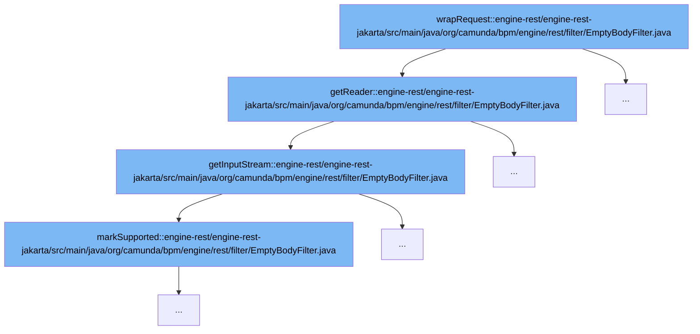

This document will cover the process of handling empty HTTP requests in the Camunda BPM platform, which includes:

1. Wrapping the request
2. Reading the request body
3. Checking if the request body supports marking



<SwmSnippet path="/engine-rest/engine-rest-jakarta/src/main/java/org/camunda/bpm/engine/rest/filter/EmptyBodyFilter.java" line="94">

---

# Wrapping the request

The `wrapRequest` function is the entry point of this process. It wraps the HTTP request and prepares it for further processing. This is done by calling the `getReader` function, which will read the request body.

```java
      @Override
      public BufferedReader getReader() throws IOException {
        return EmptyBodyFilter.this.getReader(this.getInputStream());
      }
```

---

</SwmSnippet>

<SwmSnippet path="/engine-rest/engine-rest-jakarta/src/main/java/org/camunda/bpm/engine/rest/filter/EmptyBodyFilter.java" line="34">

---

# Reading the request body

The `getReader` function calls `getInputStream` to read the request body. This function returns a `ServletInputStream` which is a wrapper around the actual input stream of the request. This wrapper provides additional functionality such as checking if the stream is finished (`isFinished`), ready (`isReady`), and supports marking (`markSupported`).

```java
      @Override
      public ServletInputStream getInputStream() throws IOException {

        return new ServletInputStream() {

          final InputStream inputStream = getRequestBody(isBodyEmpty, requestBody);
          boolean finished = false;

          @Override
          public boolean isFinished() {
            return this.finished;
          }

          @Override
          public boolean isReady() {
            return true;
          }

          @Override
          public void setReadListener(final ReadListener readListener) {
            throw new UnsupportedOperationException();
```

---

</SwmSnippet>

<SwmSnippet path="/engine-rest/engine-rest-jakarta/src/main/java/org/camunda/bpm/engine/rest/filter/EmptyBodyFilter.java" line="86">

---

# Checking if the request body supports marking

The `markSupported` function is called to check if the input stream supports marking. Marking an input stream allows the stream to remember its current position and reset back to this position later. This is useful in scenarios where you need to read ahead in the stream but may need to go back to the original position.

```java
          @Override
          public boolean markSupported() {
            return inputStream.markSupported();
          }
```

---

</SwmSnippet>

&nbsp;

*This is an auto-generated document by Swimm AI 🌊 and has not yet been verified by a human*

<SwmMeta version="3.0.0" repo-id="Z2l0aHViJTNBJTNBREVNTy1jYW11bmRhLWJwbS1wbGF0Zm9ybSUzQSUzQXN3aW1taW8=" repo-name="DEMO-camunda-bpm-platform"><sup>Powered by [Swimm](/)</sup></SwmMeta>
