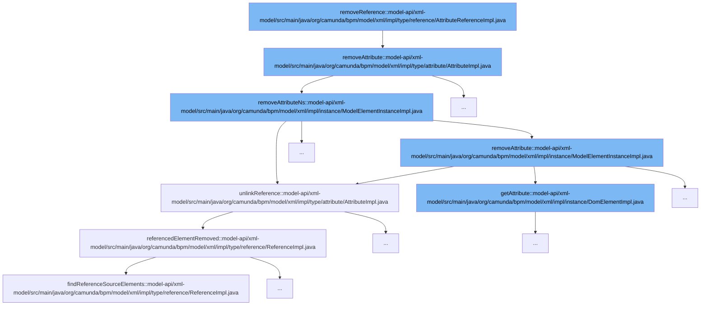

This document will cover the process of removing a reference in the Camunda BPM platform, which includes:

1. Removing an attribute
2. Removing an attribute with namespace
3. Unlinking a reference
4. Removing a referenced element



<SwmSnippet path="/model-api/xml-model/src/main/java/org/camunda/bpm/model/xml/impl/type/attribute/AttributeImpl.java" line="204">

---

# Removing an Attribute

The `removeAttribute` function is the entry point of the flow. It checks if the attribute has a namespace. If it doesn't, it removes the attribute directly. Otherwise, it calls `removeAttributeNs` to remove the attribute with its namespace.

```java
  public void removeAttribute(ModelElementInstance modelElement) {
    if (namespaceUri == null) {
      modelElement.removeAttribute(attributeName);
    }
    else {
      modelElement.removeAttributeNs(namespaceUri, attributeName);
    }
  }
```

---

</SwmSnippet>

<SwmSnippet path="/model-api/xml-model/src/main/java/org/camunda/bpm/model/xml/impl/instance/ModelElementInstanceImpl.java" line="181">

---

# Removing an Attribute with Namespace

The `removeAttributeNs` function removes an attribute with its namespace. It first retrieves the attribute by its name, then checks if the attribute exists and has a value. If so, it calls `unlinkReference` to unlink the reference from the attribute.

```java
  public void removeAttributeNs(String namespaceUri, String attributeName) {
    Attribute<?> attribute = elementType.getAttribute(attributeName);
    if (attribute != null) {
      Object identifier = attribute.getValue(this);
      if (identifier != null) {
        ((AttributeImpl<?>) attribute).unlinkReference(this, identifier);
      }
    }
    domElement.removeAttribute(namespaceUri, attributeName);
  }
```

---

</SwmSnippet>

<SwmSnippet path="/model-api/xml-model/src/main/java/org/camunda/bpm/model/xml/impl/type/attribute/AttributeImpl.java" line="213">

---

# Unlinking a Reference

The `unlinkReference` function unlinks a reference from an attribute. It iterates over all incoming references and calls `referencedElementRemoved` for each of them.

```java
  public void unlinkReference(ModelElementInstance modelElement, Object referenceIdentifier) {
    if (!incomingReferences.isEmpty()) {
      for (Reference<?> incomingReference : incomingReferences) {
        ((ReferenceImpl<?>) incomingReference).referencedElementRemoved(modelElement, referenceIdentifier);
      }
    }
  }
```

---

</SwmSnippet>

<SwmSnippet path="/model-api/xml-model/src/main/java/org/camunda/bpm/model/xml/impl/type/reference/ReferenceImpl.java" line="161">

---

# Removing a Referenced Element

The `referencedElementRemoved` function removes a referenced element. It finds all source elements of the reference and removes the reference if the identifier matches.

```java
  /**
   * Remove the reference if the target element is removed
   *
   * @param referenceTargetElement  the reference target model element instance, which is removed
   * @param referenceIdentifier  the identifier of the reference to filter reference source elements
   */
  public void referencedElementRemoved(ModelElementInstance referenceTargetElement, Object referenceIdentifier) {
    for (ModelElementInstance referenceSourceElement : findReferenceSourceElements(referenceTargetElement)) {
      if (referenceIdentifier.equals(getReferenceIdentifier(referenceSourceElement))) {
        removeReference(referenceSourceElement, referenceTargetElement);
      }
    }
  }
```

---

</SwmSnippet>

&nbsp;

*This is an auto-generated document by Swimm AI 🌊 and has not yet been verified by a human*

<SwmMeta version="3.0.0" repo-id="Z2l0aHViJTNBJTNBREVNTy1jYW11bmRhLWJwbS1wbGF0Zm9ybSUzQSUzQXN3aW1taW8=" repo-name="DEMO-camunda-bpm-platform"><sup>Powered by [Swimm](/)</sup></SwmMeta>
