This document will cover the process of removing a referenced element in the Camunda BPM platform, which includes:

1. Finding reference source elements
2. Removing the reference
3. Performing the remove operation
4. Unlinking all child references
5. Unlinking all references.

```mermaid
graph TD;
  referencedElementRemoved::model-api/xml-model/src/main/java/org/camunda/bpm/model/xml/impl/type/reference/IdsElementReferenceCollectionImpl.java:::mainFlowStyle --> findReferenceSourceElements::model-api/xml-model/src/main/java/org/camunda/bpm/model/xml/impl/type/reference/ReferenceImpl.java
  referencedElementRemoved::model-api/xml-model/src/main/java/org/camunda/bpm/model/xml/impl/type/reference/IdsElementReferenceCollectionImpl.java:::mainFlowStyle --> removeReference::model-api/xml-model/src/main/java/org/camunda/bpm/model/xml/impl/type/reference/ElementReferenceCollectionImpl.java
  referencedElementRemoved::model-api/xml-model/src/main/java/org/camunda/bpm/model/xml/impl/type/reference/IdsElementReferenceCollectionImpl.java:::mainFlowStyle --> p4m3z[...]
  findReferenceSourceElements::model-api/xml-model/src/main/java/org/camunda/bpm/model/xml/impl/type/reference/ReferenceImpl.java --> getModelElementsByType::model-api/xml-model/src/main/java/org/camunda/bpm/model/xml/impl/ModelInstanceImpl.java
  findReferenceSourceElements::model-api/xml-model/src/main/java/org/camunda/bpm/model/xml/impl/type/reference/ReferenceImpl.java --> isBaseTypeOf::model-api/xml-model/src/main/java/org/camunda/bpm/model/xml/impl/type/ModelElementTypeImpl.java
  findReferenceSourceElements::model-api/xml-model/src/main/java/org/camunda/bpm/model/xml/impl/type/reference/ReferenceImpl.java --> ayk8o[...]
  getModelElementsByType::model-api/xml-model/src/main/java/org/camunda/bpm/model/xml/impl/ModelInstanceImpl.java --> getAllExtendingTypes::model-api/xml-model/src/main/java/org/camunda/bpm/model/xml/impl/type/ModelElementTypeImpl.java
  getModelElementsByType::model-api/xml-model/src/main/java/org/camunda/bpm/model/xml/impl/ModelInstanceImpl.java --> getInstances::model-api/xml-model/src/main/java/org/camunda/bpm/model/xml/impl/type/ModelElementTypeImpl.java
  getModelElementsByType::model-api/xml-model/src/main/java/org/camunda/bpm/model/xml/impl/ModelInstanceImpl.java --> addAll::model-api/xml-model/src/main/java/org/camunda/bpm/model/xml/impl/type/reference/ElementReferenceCollectionImpl.java
  getModelElementsByType::model-api/xml-model/src/main/java/org/camunda/bpm/model/xml/impl/ModelInstanceImpl.java --> 4duzm[...]
  isBaseTypeOf::model-api/xml-model/src/main/java/org/camunda/bpm/model/xml/impl/type/ModelElementTypeImpl.java --> calculateAllBaseTypes::model-api/xml-model/src/main/java/org/camunda/bpm/model/xml/impl/util/ModelUtil.java
  isBaseTypeOf::model-api/xml-model/src/main/java/org/camunda/bpm/model/xml/impl/type/ModelElementTypeImpl.java --> nphp7[...]
  removeReference::model-api/xml-model/src/main/java/org/camunda/bpm/model/xml/impl/type/reference/ElementReferenceCollectionImpl.java:::mainFlowStyle --> remove::model-api/xml-model/src/main/java/org/camunda/bpm/model/xml/impl/type/reference/ElementReferenceCollectionImpl.java
  removeReference::model-api/xml-model/src/main/java/org/camunda/bpm/model/xml/impl/type/reference/ElementReferenceCollectionImpl.java:::mainFlowStyle --> s7wpa[...]
  remove::model-api/xml-model/src/main/java/org/camunda/bpm/model/xml/impl/type/reference/ElementReferenceCollectionImpl.java:::mainFlowStyle --> performRemoveOperation::model-api/xml-model/src/main/java/org/camunda/bpm/model/xml/impl/type/reference/ElementReferenceCollectionImpl.java
  remove::model-api/xml-model/src/main/java/org/camunda/bpm/model/xml/impl/type/reference/ElementReferenceCollectionImpl.java:::mainFlowStyle --> bjow9[...]
  performRemoveOperation::model-api/xml-model/src/main/java/org/camunda/bpm/model/xml/impl/type/reference/ElementReferenceCollectionImpl.java:::mainFlowStyle --> removeChildElement::model-api/xml-model/src/main/java/org/camunda/bpm/model/xml/impl/instance/ModelElementInstanceImpl.java
  performRemoveOperation::model-api/xml-model/src/main/java/org/camunda/bpm/model/xml/impl/type/reference/ElementReferenceCollectionImpl.java:::mainFlowStyle --> getChildElementsByType::model-api/xml-model/src/main/java/org/camunda/bpm/model/xml/impl/instance/DomElementImpl.java
  performRemoveOperation::model-api/xml-model/src/main/java/org/camunda/bpm/model/xml/impl/type/reference/ElementReferenceCollectionImpl.java:::mainFlowStyle --> getReferenceTargetElement::model-api/xml-model/src/main/java/org/camunda/bpm/model/xml/impl/type/reference/ElementReferenceImpl.java
  performRemoveOperation::model-api/xml-model/src/main/java/org/camunda/bpm/model/xml/impl/type/reference/ElementReferenceCollectionImpl.java:::mainFlowStyle --> 095uh[...]
  removeChildElement::model-api/xml-model/src/main/java/org/camunda/bpm/model/xml/impl/instance/ModelElementInstanceImpl.java --> unlinkAllChildReferences::model-api/xml-model/src/main/java/org/camunda/bpm/model/xml/impl/instance/ModelElementInstanceImpl.java
  removeChildElement::model-api/xml-model/src/main/java/org/camunda/bpm/model/xml/impl/instance/ModelElementInstanceImpl.java --> unlinkAllReferences::model-api/xml-model/src/main/java/org/camunda/bpm/model/xml/impl/instance/ModelElementInstanceImpl.java
  removeChildElement::model-api/xml-model/src/main/java/org/camunda/bpm/model/xml/impl/instance/ModelElementInstanceImpl.java --> 9m7ov[...]
  unlinkAllChildReferences::model-api/xml-model/src/main/java/org/camunda/bpm/model/xml/impl/instance/ModelElementInstanceImpl.java --> unlinkAllReferences::model-api/xml-model/src/main/java/org/camunda/bpm/model/xml/impl/instance/ModelElementInstanceImpl.java
  unlinkAllChildReferences::model-api/xml-model/src/main/java/org/camunda/bpm/model/xml/impl/instance/ModelElementInstanceImpl.java --> getAllChildElementTypes::model-api/xml-model/src/main/java/org/camunda/bpm/model/xml/impl/type/ModelElementTypeImpl.java
  unlinkAllChildReferences::model-api/xml-model/src/main/java/org/camunda/bpm/model/xml/impl/instance/ModelElementInstanceImpl.java --> hfnbt[...]
  unlinkAllReferences::model-api/xml-model/src/main/java/org/camunda/bpm/model/xml/impl/instance/ModelElementInstanceImpl.java --> unlinkReference::model-api/xml-model/src/main/java/org/camunda/bpm/model/xml/impl/type/attribute/AttributeImpl.java
  unlinkAllReferences::model-api/xml-model/src/main/java/org/camunda/bpm/model/xml/impl/instance/ModelElementInstanceImpl.java --> getAllAttributes::model-api/xml-model/src/main/java/org/camunda/bpm/model/xml/impl/type/ModelElementTypeImpl.java
  unlinkAllReferences::model-api/xml-model/src/main/java/org/camunda/bpm/model/xml/impl/instance/ModelElementInstanceImpl.java --> oe3sm[...]
  getChildElementsByType::model-api/xml-model/src/main/java/org/camunda/bpm/model/xml/impl/instance/DomElementImpl.java --> filterNodeListByType::model-api/xml-model/src/main/java/org/camunda/bpm/model/xml/impl/util/DomUtil.java
  filterNodeListByType::model-api/xml-model/src/main/java/org/camunda/bpm/model/xml/impl/util/DomUtil.java --> filterNodeList::model-api/xml-model/src/main/java/org/camunda/bpm/model/xml/impl/util/DomUtil.java
  getReferenceTargetElement::model-api/xml-model/src/main/java/org/camunda/bpm/model/xml/impl/type/reference/ElementReferenceImpl.java:::mainFlowStyle --> getReferenceSource::model-api/xml-model/src/main/java/org/camunda/bpm/model/xml/impl/type/reference/ElementReferenceImpl.java
  getReferenceTargetElement::model-api/xml-model/src/main/java/org/camunda/bpm/model/xml/impl/type/reference/ElementReferenceImpl.java:::mainFlowStyle --> oq42v[...]
  getReferenceSource::model-api/xml-model/src/main/java/org/camunda/bpm/model/xml/impl/type/reference/ElementReferenceImpl.java:::mainFlowStyle --> getChild::model-api/xml-model/src/main/java/org/camunda/bpm/model/xml/impl/type/child/ChildElementImpl.java
  getReferenceSource::model-api/xml-model/src/main/java/org/camunda/bpm/model/xml/impl/type/reference/ElementReferenceImpl.java:::mainFlowStyle --> 1ro7f[...]
  getChild::model-api/xml-model/src/main/java/org/camunda/bpm/model/xml/impl/type/child/ChildElementImpl.java:::mainFlowStyle --> getUniqueChildElementByType::model-api/xml-model/src/main/java/org/camunda/bpm/model/xml/impl/instance/ModelElementInstanceImpl.java
  getChild::model-api/xml-model/src/main/java/org/camunda/bpm/model/xml/impl/type/child/ChildElementImpl.java:::mainFlowStyle --> dnsla[...]
  getUniqueChildElementByType::model-api/xml-model/src/main/java/org/camunda/bpm/model/xml/impl/instance/ModelElementInstanceImpl.java:::mainFlowStyle --> getChildElementsByType::model-api/xml-model/src/main/java/org/camunda/bpm/model/xml/impl/instance/ModelElementInstanceImpl.java
  getUniqueChildElementByType::model-api/xml-model/src/main/java/org/camunda/bpm/model/xml/impl/instance/ModelElementInstanceImpl.java:::mainFlowStyle --> e7clc[...]
  getChildElementsByType::model-api/xml-model/src/main/java/org/camunda/bpm/model/xml/impl/instance/ModelElementInstanceImpl.java:::mainFlowStyle --> asSet::model-api/xml-model/src/main/java/org/camunda/bpm/model/xml/impl/instance/ModelElementInstanceImpl.java
  getChildElementsByType::model-api/xml-model/src/main/java/org/camunda/bpm/model/xml/impl/instance/ModelElementInstanceImpl.java:::mainFlowStyle --> addAll::model-api/xml-model/src/main/java/org/camunda/bpm/model/xml/impl/type/reference/ElementReferenceCollectionImpl.java
  getChildElementsByType::model-api/xml-model/src/main/java/org/camunda/bpm/model/xml/impl/instance/ModelElementInstanceImpl.java:::mainFlowStyle --> getChildElementsByNameNs::model-api/xml-model/src/main/java/org/camunda/bpm/model/xml/impl/instance/DomElementImpl.java
  getChildElementsByType::model-api/xml-model/src/main/java/org/camunda/bpm/model/xml/impl/instance/ModelElementInstanceImpl.java:::mainFlowStyle --> hwblr[...]
  asSet::model-api/xml-model/src/main/java/org/camunda/bpm/model/xml/impl/instance/ModelElementInstanceImpl.java --> addAll::model-api/xml-model/src/main/java/org/camunda/bpm/model/xml/impl/type/reference/ElementReferenceCollectionImpl.java
  asSet::model-api/xml-model/src/main/java/org/camunda/bpm/model/xml/impl/instance/ModelElementInstanceImpl.java --> add::model-api/xml-model/src/main/java/org/camunda/bpm/model/xml/impl/type/reference/ElementReferenceCollectionImpl.java
  addAll::model-api/xml-model/src/main/java/org/camunda/bpm/model/xml/impl/type/reference/ElementReferenceCollectionImpl.java --> add::model-api/xml-model/src/main/java/org/camunda/bpm/model/xml/impl/type/reference/ElementReferenceCollectionImpl.java
  addAll::model-api/xml-model/src/main/java/org/camunda/bpm/model/xml/impl/type/reference/ElementReferenceCollectionImpl.java --> gpyv8[...]
  add::model-api/xml-model/src/main/java/org/camunda/bpm/model/xml/impl/type/reference/ElementReferenceCollectionImpl.java --> performAddOperation::model-api/xml-model/src/main/java/org/camunda/bpm/model/xml/impl/type/reference/ElementReferenceCollectionImpl.java
  add::model-api/xml-model/src/main/java/org/camunda/bpm/model/xml/impl/type/reference/ElementReferenceCollectionImpl.java --> 0dgzb[...]
  getChildElementsByNameNs::model-api/xml-model/src/main/java/org/camunda/bpm/model/xml/impl/instance/DomElementImpl.java:::mainFlowStyle --> ...

 classDef mainFlowStyle color:#000000,fill:#7CB9F4
```



<SwmSnippet path="/model-api/xml-model/src/main/java/org/camunda/bpm/model/xml/impl/type/reference/ReferenceImpl.java" line="122">

---

# Finding reference source elements

The function `findReferenceSourceElements` is used to find all elements that reference a given target element. If the target element is of the correct type, it returns all elements of the source type in the same model instance. Otherwise, it returns an empty list.

```java
  public Collection<ModelElementInstance> findReferenceSourceElements(ModelElementInstance referenceTargetElement) {
    if(referenceTargetElementType.isBaseTypeOf(referenceTargetElement.getElementType())) {
      ModelElementType owningElementType = getReferenceSourceElementType();
      return referenceTargetElement.getModelInstance().getModelElementsByType(owningElementType);
    }
    else {
      return Collections.emptyList();
    }
  }
```

---

</SwmSnippet>

<SwmSnippet path="/model-api/xml-model/src/main/java/org/camunda/bpm/model/xml/impl/type/reference/ElementReferenceCollectionImpl.java" line="185">

---

# Removing the reference

The function `remove` is used to remove a reference from the collection. If the collection is immutable, it throws an exception. Otherwise, it performs the remove operation.

```java
      public boolean remove(Object o) {
        if (referenceSourceCollection.isImmutable()) {
          throw new UnsupportedModelOperationException("remove()", "collection is immutable");
        }
        else {
          ModelUtil.ensureInstanceOf(o, ModelElementInstanceImpl.class);
          performRemoveOperation(referenceSourceParentElement, o);
          return true;
        }
      }
```

---

</SwmSnippet>

<SwmSnippet path="/model-api/xml-model/src/main/java/org/camunda/bpm/model/xml/impl/type/reference/ElementReferenceCollectionImpl.java" line="75">

---

# Performing the remove operation

The function `performRemoveOperation` is used to perform the actual removal of the reference. It iterates over all child elements of the source type and removes those that reference the target element.

```java
  protected void performRemoveOperation(ModelElementInstanceImpl referenceSourceParentElement, Object referenceTargetElement) {
    Collection<ModelElementInstance> referenceSourceChildElements = referenceSourceParentElement.getChildElementsByType(referenceSourceType);
    for (ModelElementInstance referenceSourceChildElement : referenceSourceChildElements) {
      if (getReferenceTargetElement(referenceSourceChildElement).equals(referenceTargetElement)) {
        referenceSourceParentElement.removeChildElement(referenceSourceChildElement);
      }
    }
  }
```

---

</SwmSnippet>

<SwmSnippet path="/model-api/xml-model/src/main/java/org/camunda/bpm/model/xml/impl/instance/ModelElementInstanceImpl.java" line="367">

---

# Unlinking all child references

The function `unlinkAllChildReferences` is used to remove all references to the children of a given element. It iterates over all child element types and removes references to elements of each type.

```java
  /**
   * Removes every reference to children of this.
   */
  private void unlinkAllChildReferences() {
    List<ModelElementType> childElementTypes = elementType.getAllChildElementTypes();
    for (ModelElementType type : childElementTypes) {
      Collection<ModelElementInstance> childElementsForType = getChildElementsByType(type);
      for (ModelElementInstance childElement : childElementsForType) {
        ((ModelElementInstanceImpl) childElement).unlinkAllReferences();
      }
    }
  }
```

---

</SwmSnippet>

<SwmSnippet path="/model-api/xml-model/src/main/java/org/camunda/bpm/model/xml/impl/instance/ModelElementInstanceImpl.java" line="354">

---

# Unlinking all references

The function `unlinkAllReferences` is used to remove all references to a given element. It iterates over all attributes of the element and unlinks the reference for each attribute.

```java
  /**
   * Removes all reference to this.
   */
  private void unlinkAllReferences() {
    Collection<Attribute<?>> attributes = elementType.getAllAttributes();
    for (Attribute<?> attribute : attributes) {
      Object identifier = attribute.getValue(this);
      if (identifier != null) {
        ((AttributeImpl<?>) attribute).unlinkReference(this, identifier);
      }
    }
  }
```

---

</SwmSnippet>

&nbsp;

*This is an auto-generated document by Swimm AI 🌊 and has not yet been verified by a human*

<SwmMeta version="3.0.0" repo-id="Z2l0aHViJTNBJTNBREVNTy1jYW11bmRhLWJwbS1wbGF0Zm9ybSUzQSUzQXN3aW1taW8=" repo-name="DEMO-camunda-bpm-platform"><sup>Powered by [Swimm](/)</sup></SwmMeta>
