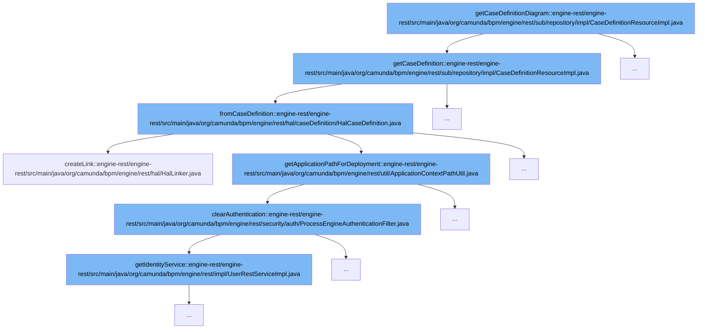

This document will cover the process of retrieving a case definition diagram in the Camunda BPM platform. The process includes the following steps:

1. Retrieving the case definition
2. Constructing a HAL (Hypertext Application Language) representation of the case definition
3. Creating links for the HAL representation
4. Clearing the authentication for the process engine.



<SwmSnippet path="/engine-rest/engine-rest/src/main/java/org/camunda/bpm/engine/rest/sub/repository/impl/CaseDefinitionResourceImpl.java" line="70">

---

# Retrieving the case definition

The `getCaseDefinition` method retrieves the case definition from the repository service. If the case definition is not found, or if there's an error, it throws an exception. Otherwise, it returns a DTO (Data Transfer Object) representation of the case definition.

```java
  @Override
  public CaseDefinitionDto getCaseDefinition() {
    RepositoryService repositoryService = engine.getRepositoryService();

    CaseDefinition definition = null;

    try {
      definition = repositoryService.getCaseDefinition(caseDefinitionId);

    } catch (NotFoundException e) {
      throw new InvalidRequestException(Status.NOT_FOUND, e, e.getMessage());

    } catch (NotValidException e) {
      throw new InvalidRequestException(Status.BAD_REQUEST, e, e.getMessage());

    } catch (ProcessEngineException e) {
      throw new RestException(Status.INTERNAL_SERVER_ERROR, e);

    }

    return CaseDefinitionDto.fromCaseDefinition(definition);
```

---

</SwmSnippet>

<SwmSnippet path="/engine-rest/engine-rest/src/main/java/org/camunda/bpm/engine/rest/hal/caseDefinition/HalCaseDefinition.java" line="55">

---

# Constructing a HAL representation of the case definition

The `fromCaseDefinition` method constructs a HAL representation of the case definition. It sets the properties of the HAL case definition and creates links for it.

```java
  public static HalCaseDefinition fromCaseDefinition(CaseDefinition caseDefinition, ProcessEngine processEngine) {
    HalCaseDefinition halCaseDefinition = new HalCaseDefinition();

    halCaseDefinition.id = caseDefinition.getId();
    halCaseDefinition.key = caseDefinition.getKey();
    halCaseDefinition.category = caseDefinition.getCategory();
    halCaseDefinition.name = caseDefinition.getName();
    halCaseDefinition.version = caseDefinition.getVersion();
    halCaseDefinition.resource = caseDefinition.getResourceName();
    halCaseDefinition.deploymentId = caseDefinition.getDeploymentId();
    halCaseDefinition.contextPath = ApplicationContextPathUtil.getApplicationPathForDeployment(processEngine, caseDefinition.getDeploymentId());

    halCaseDefinition.linker.createLink(REL_SELF, caseDefinition.getId());
    halCaseDefinition.linker.createLink(REL_DEPLOYMENT, caseDefinition.getDeploymentId());
    halCaseDefinition.linker.createLink(REL_DEPLOYMENT_RESOURCE, caseDefinition.getDeploymentId(), caseDefinition.getResourceName());

    return halCaseDefinition;
  }
```

---

</SwmSnippet>

<SwmSnippet path="/engine-rest/engine-rest/src/main/java/org/camunda/bpm/engine/rest/hal/HalLinker.java" line="49">

---

# Creating links for the HAL representation

The `createLink` method creates a link for a given relation in the HAL representation. It populates the URL template with the provided path parameters.

```java
  /**
   * Creates a link in a given relation.
   *
   * @param rel the {@link HalRelation} for which a link should be constructed
   * @param pathParams the path params to populate the url template with.
   * */
  public void createLink(HalRelation rel, String... pathParams) {
    if(pathParams != null && pathParams.length > 0 && pathParams[0] != null) {
      Set<String> linkedResourceIds = linkedResources.get(rel);
      if(linkedResourceIds == null) {
        linkedResourceIds = new HashSet<String>();
        linkedResources.put(rel, linkedResourceIds);
      }

      // Hmm... use the last id in the pathParams as linked resource id
      linkedResourceIds.add(pathParams[pathParams.length - 1]);

      resource.addLink(rel.relName, rel.uriTemplate.build((Object[])pathParams));
    }
  }
```

---

</SwmSnippet>

<SwmSnippet path="/engine-rest/engine-rest/src/main/java/org/camunda/bpm/engine/rest/security/auth/ProcessEngineAuthenticationFilter.java" line="208">

---

# Clearing the authentication for the process engine

The `clearAuthentication` method clears the authentication for the process engine. It does this by calling the `clearAuthentication` method of the identity service.

```java
  protected void clearAuthentication(ProcessEngine engine) {
    engine.getIdentityService().clearAuthentication();
  }
```

---

</SwmSnippet>

&nbsp;

*This is an auto-generated document by Swimm AI 🌊 and has not yet been verified by a human*

<SwmMeta version="3.0.0" repo-id="Z2l0aHViJTNBJTNBREVNTy1jYW11bmRhLWJwbS1wbGF0Zm9ybSUzQSUzQXN3aW1taW8=" repo-name="DEMO-camunda-bpm-platform"><sup>Powered by [Swimm](/)</sup></SwmMeta>
