This document will cover the process of setting a reference target element in the Camunda BPM platform, which includes:

1. Setting the reference source
2. Setting the child element
3. Performing the add operation
4. Setting the unique child element by name namespace
5. Updating incoming references
6. Unlinking all child references

```mermaid
graph TD;
  setReferenceTargetElement::model-api/xml-model/src/main/java/org/camunda/bpm/model/xml/impl/type/reference/ElementReferenceImpl.java:::mainFlowStyle --> setReferenceSource::model-api/xml-model/src/main/java/org/camunda/bpm/model/xml/impl/type/reference/ElementReferenceImpl.java
  setReferenceTargetElement::model-api/xml-model/src/main/java/org/camunda/bpm/model/xml/impl/type/reference/ElementReferenceImpl.java:::mainFlowStyle --> twwh6[...]
  setReferenceSource::model-api/xml-model/src/main/java/org/camunda/bpm/model/xml/impl/type/reference/ElementReferenceImpl.java:::mainFlowStyle --> setChild::model-api/xml-model/src/main/java/org/camunda/bpm/model/xml/impl/type/child/ChildElementImpl.java
  setReferenceSource::model-api/xml-model/src/main/java/org/camunda/bpm/model/xml/impl/type/reference/ElementReferenceImpl.java:::mainFlowStyle --> 6ay64[...]
  setChild::model-api/xml-model/src/main/java/org/camunda/bpm/model/xml/impl/type/child/ChildElementImpl.java:::mainFlowStyle --> performAddOperation::model-api/xml-model/src/main/java/org/camunda/bpm/model/xml/impl/type/child/ChildElementImpl.java
  performAddOperation::model-api/xml-model/src/main/java/org/camunda/bpm/model/xml/impl/type/child/ChildElementImpl.java:::mainFlowStyle --> setUniqueChildElementByNameNs::model-api/xml-model/src/main/java/org/camunda/bpm/model/xml/impl/instance/ModelElementInstanceImpl.java
  setUniqueChildElementByNameNs::model-api/xml-model/src/main/java/org/camunda/bpm/model/xml/impl/instance/ModelElementInstanceImpl.java:::mainFlowStyle --> addChildElement::model-api/xml-model/src/main/java/org/camunda/bpm/model/xml/impl/instance/ModelElementInstanceImpl.java
  setUniqueChildElementByNameNs::model-api/xml-model/src/main/java/org/camunda/bpm/model/xml/impl/instance/ModelElementInstanceImpl.java:::mainFlowStyle --> getUniqueChildElementByNameNs::model-api/xml-model/src/main/java/org/camunda/bpm/model/xml/impl/instance/ModelElementInstanceImpl.java
  setUniqueChildElementByNameNs::model-api/xml-model/src/main/java/org/camunda/bpm/model/xml/impl/instance/ModelElementInstanceImpl.java:::mainFlowStyle --> replaceChildElement::model-api/xml-model/src/main/java/org/camunda/bpm/model/xml/impl/instance/ModelElementInstanceImpl.java
  setUniqueChildElementByNameNs::model-api/xml-model/src/main/java/org/camunda/bpm/model/xml/impl/instance/ModelElementInstanceImpl.java:::mainFlowStyle --> yzcmi[...]
  addChildElement::model-api/xml-model/src/main/java/org/camunda/bpm/model/xml/impl/instance/ModelElementInstanceImpl.java --> findElementToInsertAfter::model-api/xml-model/src/main/java/org/camunda/bpm/model/xml/impl/instance/ModelElementInstanceImpl.java
  addChildElement::model-api/xml-model/src/main/java/org/camunda/bpm/model/xml/impl/instance/ModelElementInstanceImpl.java --> ubij4[...]
  findElementToInsertAfter::model-api/xml-model/src/main/java/org/camunda/bpm/model/xml/impl/instance/ModelElementInstanceImpl.java --> getIndexOfElementType::model-api/xml-model/src/main/java/org/camunda/bpm/model/xml/impl/util/ModelUtil.java
  findElementToInsertAfter::model-api/xml-model/src/main/java/org/camunda/bpm/model/xml/impl/instance/ModelElementInstanceImpl.java --> getChildElements::model-api/xml-model/src/main/java/org/camunda/bpm/model/xml/impl/instance/DomElementImpl.java
  findElementToInsertAfter::model-api/xml-model/src/main/java/org/camunda/bpm/model/xml/impl/instance/ModelElementInstanceImpl.java --> getAllChildElementTypes::model-api/xml-model/src/main/java/org/camunda/bpm/model/xml/impl/type/ModelElementTypeImpl.java
  findElementToInsertAfter::model-api/xml-model/src/main/java/org/camunda/bpm/model/xml/impl/instance/ModelElementInstanceImpl.java --> 6b14d[...]
  getUniqueChildElementByNameNs::model-api/xml-model/src/main/java/org/camunda/bpm/model/xml/impl/instance/ModelElementInstanceImpl.java --> asSet::model-api/xml-model/src/main/java/org/camunda/bpm/model/xml/impl/instance/ModelElementInstanceImpl.java
  getUniqueChildElementByNameNs::model-api/xml-model/src/main/java/org/camunda/bpm/model/xml/impl/instance/ModelElementInstanceImpl.java --> getChildElementsByNameNs::model-api/xml-model/src/main/java/org/camunda/bpm/model/xml/impl/instance/DomElementImpl.java
  getUniqueChildElementByNameNs::model-api/xml-model/src/main/java/org/camunda/bpm/model/xml/impl/instance/ModelElementInstanceImpl.java --> p8ync[...]
  asSet::model-api/xml-model/src/main/java/org/camunda/bpm/model/xml/impl/instance/ModelElementInstanceImpl.java --> addAll::model-api/xml-model/src/main/java/org/camunda/bpm/model/xml/impl/type/reference/ElementReferenceCollectionImpl.java
  asSet::model-api/xml-model/src/main/java/org/camunda/bpm/model/xml/impl/instance/ModelElementInstanceImpl.java --> add::model-api/xml-model/src/main/java/org/camunda/bpm/model/xml/impl/type/reference/ElementReferenceCollectionImpl.java
  getChildElementsByNameNs::model-api/xml-model/src/main/java/org/camunda/bpm/model/xml/impl/instance/DomElementImpl.java --> filterNodeListByName::model-api/xml-model/src/main/java/org/camunda/bpm/model/xml/impl/util/DomUtil.java
  replaceChildElement::model-api/xml-model/src/main/java/org/camunda/bpm/model/xml/impl/instance/ModelElementInstanceImpl.java:::mainFlowStyle --> updateIncomingReferences::model-api/xml-model/src/main/java/org/camunda/bpm/model/xml/impl/instance/ModelElementInstanceImpl.java
  replaceChildElement::model-api/xml-model/src/main/java/org/camunda/bpm/model/xml/impl/instance/ModelElementInstanceImpl.java:::mainFlowStyle --> unlinkAllChildReferences::model-api/xml-model/src/main/java/org/camunda/bpm/model/xml/impl/instance/ModelElementInstanceImpl.java
  replaceChildElement::model-api/xml-model/src/main/java/org/camunda/bpm/model/xml/impl/instance/ModelElementInstanceImpl.java:::mainFlowStyle --> exk3h[...]
  updateIncomingReferences::model-api/xml-model/src/main/java/org/camunda/bpm/model/xml/impl/instance/ModelElementInstanceImpl.java --> referencedElementUpdated::model-api/xml-model/src/main/java/org/camunda/bpm/model/xml/impl/type/reference/ReferenceImpl.java
  updateIncomingReferences::model-api/xml-model/src/main/java/org/camunda/bpm/model/xml/impl/instance/ModelElementInstanceImpl.java --> getAllAttributes::model-api/xml-model/src/main/java/org/camunda/bpm/model/xml/impl/type/ModelElementTypeImpl.java
  updateIncomingReferences::model-api/xml-model/src/main/java/org/camunda/bpm/model/xml/impl/instance/ModelElementInstanceImpl.java --> zov5k[...]
  referencedElementUpdated::model-api/xml-model/src/main/java/org/camunda/bpm/model/xml/impl/type/reference/ReferenceImpl.java --> findReferenceSourceElements::model-api/xml-model/src/main/java/org/camunda/bpm/model/xml/impl/type/reference/ReferenceImpl.java
  referencedElementUpdated::model-api/xml-model/src/main/java/org/camunda/bpm/model/xml/impl/type/reference/ReferenceImpl.java --> 9fp40[...]
  getAllAttributes::model-api/xml-model/src/main/java/org/camunda/bpm/model/xml/impl/type/ModelElementTypeImpl.java --> addAll::model-api/xml-model/src/main/java/org/camunda/bpm/model/xml/impl/type/reference/ElementReferenceCollectionImpl.java
  getAllAttributes::model-api/xml-model/src/main/java/org/camunda/bpm/model/xml/impl/type/ModelElementTypeImpl.java --> calculateAllBaseTypes::model-api/xml-model/src/main/java/org/camunda/bpm/model/xml/impl/util/ModelUtil.java
  getAllAttributes::model-api/xml-model/src/main/java/org/camunda/bpm/model/xml/impl/type/ModelElementTypeImpl.java --> wanu8[...]
  unlinkAllChildReferences::model-api/xml-model/src/main/java/org/camunda/bpm/model/xml/impl/instance/ModelElementInstanceImpl.java:::mainFlowStyle --> getChildElementsByType::model-api/xml-model/src/main/java/org/camunda/bpm/model/xml/impl/instance/ModelElementInstanceImpl.java
  unlinkAllChildReferences::model-api/xml-model/src/main/java/org/camunda/bpm/model/xml/impl/instance/ModelElementInstanceImpl.java:::mainFlowStyle --> getAllChildElementTypes::model-api/xml-model/src/main/java/org/camunda/bpm/model/xml/impl/type/ModelElementTypeImpl.java
  unlinkAllChildReferences::model-api/xml-model/src/main/java/org/camunda/bpm/model/xml/impl/instance/ModelElementInstanceImpl.java:::mainFlowStyle --> unlinkAllReferences::model-api/xml-model/src/main/java/org/camunda/bpm/model/xml/impl/instance/ModelElementInstanceImpl.java
  getChildElementsByType::model-api/xml-model/src/main/java/org/camunda/bpm/model/xml/impl/instance/ModelElementInstanceImpl.java --> asSet::model-api/xml-model/src/main/java/org/camunda/bpm/model/xml/impl/instance/ModelElementInstanceImpl.java
  getChildElementsByType::model-api/xml-model/src/main/java/org/camunda/bpm/model/xml/impl/instance/ModelElementInstanceImpl.java --> getChildElementsByNameNs::model-api/xml-model/src/main/java/org/camunda/bpm/model/xml/impl/instance/DomElementImpl.java
  getChildElementsByType::model-api/xml-model/src/main/java/org/camunda/bpm/model/xml/impl/instance/ModelElementInstanceImpl.java --> addAll::model-api/xml-model/src/main/java/org/camunda/bpm/model/xml/impl/type/reference/ElementReferenceCollectionImpl.java
  getChildElementsByType::model-api/xml-model/src/main/java/org/camunda/bpm/model/xml/impl/instance/ModelElementInstanceImpl.java --> quemo[...]
  addAll::model-api/xml-model/src/main/java/org/camunda/bpm/model/xml/impl/type/reference/ElementReferenceCollectionImpl.java --> add::model-api/xml-model/src/main/java/org/camunda/bpm/model/xml/impl/type/reference/ElementReferenceCollectionImpl.java
  addAll::model-api/xml-model/src/main/java/org/camunda/bpm/model/xml/impl/type/reference/ElementReferenceCollectionImpl.java --> fq8ie[...]
  getAllChildElementTypes::model-api/xml-model/src/main/java/org/camunda/bpm/model/xml/impl/type/ModelElementTypeImpl.java --> addAll::model-api/xml-model/src/main/java/org/camunda/bpm/model/xml/impl/type/reference/ElementReferenceCollectionImpl.java
  getAllChildElementTypes::model-api/xml-model/src/main/java/org/camunda/bpm/model/xml/impl/type/ModelElementTypeImpl.java --> xsqhv[...]
  unlinkAllReferences::model-api/xml-model/src/main/java/org/camunda/bpm/model/xml/impl/instance/ModelElementInstanceImpl.java:::mainFlowStyle --> getAllAttributes::model-api/xml-model/src/main/java/org/camunda/bpm/model/xml/impl/type/ModelElementTypeImpl.java
  unlinkAllReferences::model-api/xml-model/src/main/java/org/camunda/bpm/model/xml/impl/instance/ModelElementInstanceImpl.java:::mainFlowStyle --> unlinkReference::model-api/xml-model/src/main/java/org/camunda/bpm/model/xml/impl/type/attribute/AttributeImpl.java
  unlinkAllReferences::model-api/xml-model/src/main/java/org/camunda/bpm/model/xml/impl/instance/ModelElementInstanceImpl.java:::mainFlowStyle --> gf23n[...]
  calculateAllBaseTypes::model-api/xml-model/src/main/java/org/camunda/bpm/model/xml/impl/util/ModelUtil.java --> resolveBaseTypes::model-api/xml-model/src/main/java/org/camunda/bpm/model/xml/impl/type/ModelElementTypeImpl.java
  unlinkReference::model-api/xml-model/src/main/java/org/camunda/bpm/model/xml/impl/type/attribute/AttributeImpl.java:::mainFlowStyle --> referencedElementRemoved::model-api/xml-model/src/main/java/org/camunda/bpm/model/xml/impl/type/reference/ReferenceImpl.java
  unlinkReference::model-api/xml-model/src/main/java/org/camunda/bpm/model/xml/impl/type/attribute/AttributeImpl.java:::mainFlowStyle --> ep9u9[...]
  referencedElementRemoved::model-api/xml-model/src/main/java/org/camunda/bpm/model/xml/impl/type/reference/ReferenceImpl.java:::mainFlowStyle --> ...

 classDef mainFlowStyle color:#000000,fill:#7CB9F4
```



<SwmSnippet path="/model-api/xml-model/src/main/java/org/camunda/bpm/model/xml/impl/type/reference/ElementReferenceImpl.java" line="45">

---

# Setting the reference source

The function `setReferenceSource` is used to set the reference source for a given model element instance. It calls the `setChild` method of the `getReferenceSourceChild` object.

```java
  private void setReferenceSource(ModelElementInstance referenceSourceParent, Source referenceSource) {
    getReferenceSourceChild().setChild(referenceSourceParent, referenceSource);
  }
```

---

</SwmSnippet>

<SwmSnippet path="/model-api/xml-model/src/main/java/org/camunda/bpm/model/xml/impl/type/child/ChildElementImpl.java" line="43">

---

# Setting the child element

The function `setChild` is used to set the child element for a given model element instance. It calls the `performAddOperation` method to add the new child element.

```java
  public void setChild(ModelElementInstance element, T newChildElement) {
    performAddOperation((ModelElementInstanceImpl) element, newChildElement);
  }
```

---

</SwmSnippet>

<SwmSnippet path="/model-api/xml-model/src/main/java/org/camunda/bpm/model/xml/impl/type/child/ChildElementImpl.java" line="38">

---

# Performing the add operation

The function `performAddOperation` is used to add a new child element to a given model element instance. It calls the `setUniqueChildElementByNameNs` method to set the unique child element by name namespace.

```java
  /** the add operation replaces the child */
  private void performAddOperation(ModelElementInstanceImpl modelElement, T e) {
    modelElement.setUniqueChildElementByNameNs(e);
  }
```

---

</SwmSnippet>

<SwmSnippet path="/model-api/xml-model/src/main/java/org/camunda/bpm/model/xml/impl/instance/ModelElementInstanceImpl.java" line="226">

---

# Setting the unique child element by name namespace

The function `setUniqueChildElementByNameNs` is used to set the unique child element by name namespace for a given model element instance. It checks if an existing child element with the same name namespace exists. If it does, it replaces the existing child element with the new child element. If it doesn't, it adds the new child element.

```java
  public void setUniqueChildElementByNameNs(ModelElementInstance newChild) {
    ModelUtil.ensureInstanceOf(newChild, ModelElementInstanceImpl.class);
    ModelElementInstanceImpl newChildElement = (ModelElementInstanceImpl) newChild;

    DomElement childElement = newChildElement.getDomElement();
    ModelElementInstance existingChild = getUniqueChildElementByNameNs(childElement.getNamespaceURI(), childElement.getLocalName());
    if(existingChild == null) {
      addChildElement(newChild);
    } else {
      replaceChildElement(existingChild, newChildElement);
    }
  }
```

---

</SwmSnippet>

<SwmSnippet path="/model-api/xml-model/src/main/java/org/camunda/bpm/model/xml/impl/instance/ModelElementInstanceImpl.java" line="256">

---

# Updating incoming references

The function `updateIncomingReferences` is used to update the incoming references for a given model element instance. It checks if the old and new identifiers are not null. If they are not, it updates the reference for each incoming reference.

```java
  @SuppressWarnings("unchecked")
  private void updateIncomingReferences(ModelElementInstance oldInstance, ModelElementInstance newInstance) {
    String oldId = oldInstance.getAttributeValue("id");
    String newId = newInstance.getAttributeValue("id");

    if (oldId == null || newId == null) {
      return;
    }

    Collection<Attribute<?>> attributes = ((ModelElementTypeImpl) oldInstance.getElementType()).getAllAttributes();
    for (Attribute<?> attribute : attributes) {
      if (attribute.isIdAttribute()) {
        for (Reference<?> incomingReference : attribute.getIncomingReferences()) {
          ((ReferenceImpl<ModelElementInstance>) incomingReference).referencedElementUpdated(newInstance, oldId, newId);
        }
      }
    }

  }
```

---

</SwmSnippet>

<SwmSnippet path="/model-api/xml-model/src/main/java/org/camunda/bpm/model/xml/impl/instance/ModelElementInstanceImpl.java" line="256">

---

# Unlinking all child references

The function `unlinkAllChildReferences` is used to unlink all child references for a given model element instance. It calls the `getChildElementsByType` method to get all child elements by type and the `unlinkAllReferences` method to unlink all references.

```java
  @SuppressWarnings("unchecked")
  private void updateIncomingReferences(ModelElementInstance oldInstance, ModelElementInstance newInstance) {
    String oldId = oldInstance.getAttributeValue("id");
    String newId = newInstance.getAttributeValue("id");

    if (oldId == null || newId == null) {
      return;
    }

    Collection<Attribute<?>> attributes = ((ModelElementTypeImpl) oldInstance.getElementType()).getAllAttributes();
    for (Attribute<?> attribute : attributes) {
      if (attribute.isIdAttribute()) {
        for (Reference<?> incomingReference : attribute.getIncomingReferences()) {
          ((ReferenceImpl<ModelElementInstance>) incomingReference).referencedElementUpdated(newInstance, oldId, newId);
        }
      }
    }

  }
```

---

</SwmSnippet>

&nbsp;

*This is an auto-generated document by Swimm AI 🌊 and has not yet been verified by a human*

<SwmMeta version="3.0.0" repo-id="Z2l0aHViJTNBJTNBREVNTy1jYW11bmRhLWJwbS1wbGF0Zm9ybSUzQSUzQXN3aW1taW8=" repo-name="DEMO-camunda-bpm-platform"><sup>Powered by [Swimm](/)</sup></SwmMeta>
