This document will cover the process of task acquisition and handling in the Camunda BPM platform, specifically focusing on the `FetchAndLockHandlerImpl.java` class. The main topics covered are:

1. Task acquisition
2. Task fetching and locking
3. Task suspension and exception handling.

```mermaid
graph TD;
  run::engine-rest/engine-rest/src/main/java/org/camunda/bpm/engine/rest/impl/FetchAndLockHandlerImpl.java:::mainFlowStyle --> acquire::engine-rest/engine-rest/src/main/java/org/camunda/bpm/engine/rest/impl/FetchAndLockHandlerImpl.java
  run::engine-rest/engine-rest/src/main/java/org/camunda/bpm/engine/rest/impl/FetchAndLockHandlerImpl.java:::mainFlowStyle --> 8cryu[...]
  acquire::engine-rest/engine-rest/src/main/java/org/camunda/bpm/engine/rest/impl/FetchAndLockHandlerImpl.java:::mainFlowStyle --> getTasks::engine-rest/engine-rest/src/main/java/org/camunda/bpm/engine/rest/impl/TaskRestServiceImpl.java
  acquire::engine-rest/engine-rest/src/main/java/org/camunda/bpm/engine/rest/impl/FetchAndLockHandlerImpl.java:::mainFlowStyle --> tryFetchAndLock::engine-rest/engine-rest/src/main/java/org/camunda/bpm/engine/rest/impl/FetchAndLockHandlerImpl.java
  acquire::engine-rest/engine-rest/src/main/java/org/camunda/bpm/engine/rest/impl/FetchAndLockHandlerImpl.java:::mainFlowStyle --> suspend::engine-rest/engine-rest/src/main/java/org/camunda/bpm/engine/rest/impl/FetchAndLockHandlerImpl.java
  acquire::engine-rest/engine-rest/src/main/java/org/camunda/bpm/engine/rest/impl/FetchAndLockHandlerImpl.java:::mainFlowStyle --> wk90y[...]
  getTasks::engine-rest/engine-rest/src/main/java/org/camunda/bpm/engine/rest/impl/TaskRestServiceImpl.java --> getHalTasks::engine-rest/engine-rest/src/main/java/org/camunda/bpm/engine/rest/impl/TaskRestServiceImpl.java
  getTasks::engine-rest/engine-rest/src/main/java/org/camunda/bpm/engine/rest/impl/TaskRestServiceImpl.java --> jm4oq[...]
  getHalTasks::engine-rest/engine-rest/src/main/java/org/camunda/bpm/engine/rest/impl/TaskRestServiceImpl.java --> generate::engine-rest/engine-rest/src/main/java/org/camunda/bpm/engine/rest/hal/task/HalTaskList.java
  getHalTasks::engine-rest/engine-rest/src/main/java/org/camunda/bpm/engine/rest/impl/TaskRestServiceImpl.java --> vm4sk[...]
  tryFetchAndLock::engine-rest/engine-rest/src/main/java/org/camunda/bpm/engine/rest/impl/FetchAndLockHandlerImpl.java --> executeFetchAndLock::engine-rest/engine-rest/src/main/java/org/camunda/bpm/engine/rest/impl/FetchAndLockHandlerImpl.java
  tryFetchAndLock::engine-rest/engine-rest/src/main/java/org/camunda/bpm/engine/rest/impl/FetchAndLockHandlerImpl.java --> m9i4n[...]
  executeFetchAndLock::engine-rest/engine-rest/src/main/java/org/camunda/bpm/engine/rest/impl/FetchAndLockHandlerImpl.java --> buildQuery::engine-rest/engine-rest/src/main/java/org/camunda/bpm/engine/rest/dto/externaltask/FetchExternalTasksDto.java
  executeFetchAndLock::engine-rest/engine-rest/src/main/java/org/camunda/bpm/engine/rest/impl/FetchAndLockHandlerImpl.java --> fromLockedExternalTasks::engine-rest/engine-rest/src/main/java/org/camunda/bpm/engine/rest/dto/externaltask/LockedExternalTaskDto.java
  executeFetchAndLock::engine-rest/engine-rest/src/main/java/org/camunda/bpm/engine/rest/impl/FetchAndLockHandlerImpl.java --> t6aef[...]
  suspend::engine-rest/engine-rest/src/main/java/org/camunda/bpm/engine/rest/impl/FetchAndLockHandlerImpl.java:::mainFlowStyle --> suspendAcquisition::engine-rest/engine-rest/src/main/java/org/camunda/bpm/engine/rest/impl/FetchAndLockHandlerImpl.java
  suspendAcquisition::engine-rest/engine-rest/src/main/java/org/camunda/bpm/engine/rest/impl/FetchAndLockHandlerImpl.java:::mainFlowStyle --> log::engine-rest/engine-rest/src/main/java/org/camunda/bpm/engine/rest/exception/ExceptionLogger.java
  suspendAcquisition::engine-rest/engine-rest/src/main/java/org/camunda/bpm/engine/rest/impl/FetchAndLockHandlerImpl.java:::mainFlowStyle --> s0g84[...]
  log::engine-rest/engine-rest/src/main/java/org/camunda/bpm/engine/rest/exception/ExceptionLogger.java:::mainFlowStyle --> getStatus::engine-rest/engine-rest/src/main/java/org/camunda/bpm/engine/rest/exception/ExceptionHandlerHelper.java
  log::engine-rest/engine-rest/src/main/java/org/camunda/bpm/engine/rest/exception/ExceptionLogger.java:::mainFlowStyle --> 624f3[...]
  getStatus::engine-rest/engine-rest/src/main/java/org/camunda/bpm/engine/rest/exception/ExceptionHandlerHelper.java:::mainFlowStyle --> getResponse::engine-rest/engine-rest/src/main/java/org/camunda/bpm/engine/rest/exception/ExceptionHandlerHelper.java
  getStatus::engine-rest/engine-rest/src/main/java/org/camunda/bpm/engine/rest/exception/ExceptionHandlerHelper.java:::mainFlowStyle --> g7vnn[...]
  getResponse::engine-rest/engine-rest/src/main/java/org/camunda/bpm/engine/rest/exception/ExceptionHandlerHelper.java:::mainFlowStyle --> provideExceptionCode::engine-rest/engine-rest/src/main/java/org/camunda/bpm/engine/rest/exception/ExceptionHandlerHelper.java
  getResponse::engine-rest/engine-rest/src/main/java/org/camunda/bpm/engine/rest/exception/ExceptionHandlerHelper.java:::mainFlowStyle --> o2sjp[...]
  provideExceptionCode::engine-rest/engine-rest/src/main/java/org/camunda/bpm/engine/rest/exception/ExceptionHandlerHelper.java:::mainFlowStyle --> getCode::engine-rest/engine-rest/src/main/java/org/camunda/bpm/engine/rest/exception/ExceptionHandlerHelper.java
  provideExceptionCode::engine-rest/engine-rest/src/main/java/org/camunda/bpm/engine/rest/exception/ExceptionHandlerHelper.java:::mainFlowStyle --> fk7wv[...]
  getCode::engine-rest/engine-rest/src/main/java/org/camunda/bpm/engine/rest/exception/ExceptionHandlerHelper.java:::mainFlowStyle --> ...

 classDef mainFlowStyle color:#000000,fill:#7CB9F4
```



<SwmSnippet path="/engine-rest/engine-rest/src/main/java/org/camunda/bpm/engine/rest/impl/FetchAndLockHandlerImpl.java" line="89">

---

# Task Acquisition

The `acquire` method is responsible for acquiring new tasks. It drains the queue of new requests and adds them to the list of pending requests. It then iterates over the pending requests and attempts to fetch and lock each one. If a request is successful, it is removed from the pending requests. If there are no more pending requests, the acquisition is suspended.

```java
  protected void acquire() {
    LOG.log(Level.FINEST, "Acquire start");

    queue.drainTo(newRequests);

    if (!newRequests.isEmpty()) {
      if (isUniqueWorkerRequest) {
        removeDuplicates();
      }

      pendingRequests.addAll(newRequests);
      newRequests.clear();
    }

    LOG.log(Level.FINEST, "Number of pending requests {0}", pendingRequests.size());

    long backoffTime = MAX_BACK_OFF_TIME; //timestamp

    Iterator<FetchAndLockRequest> iterator = pendingRequests.iterator();
    while (iterator.hasNext()) {

```

---

</SwmSnippet>

<SwmSnippet path="/engine-rest/engine-rest/src/main/java/org/camunda/bpm/engine/rest/impl/FetchAndLockHandlerImpl.java" line="264">

---

# Task Fetching and Locking

The `executeFetchAndLock` method is used to fetch and lock tasks based on the provided `FetchExternalTasksExtendedDto` object. It builds a query using the DTO and executes it to fetch and lock the tasks.

```java
  protected List<LockedExternalTaskDto> executeFetchAndLock(FetchExternalTasksExtendedDto fetchingDto, ProcessEngine processEngine) {
    ExternalTaskQueryTopicBuilder fetchBuilder = fetchingDto.buildQuery(processEngine);
    List<LockedExternalTask> externalTasks = fetchBuilder.execute();

    return LockedExternalTaskDto.fromLockedExternalTasks(externalTasks);
  }
```

---

</SwmSnippet>

<SwmSnippet path="/engine-rest/engine-rest/src/main/java/org/camunda/bpm/engine/rest/impl/FetchAndLockHandlerImpl.java" line="212">

---

# Task Suspension and Exception Handling

The `suspendAcquisition` method is used to suspend the acquisition of tasks for a certain amount of time. If an exception occurs during this process, it is logged using the `log` method in the `ExceptionLogger.java` class, which determines the status of the exception and logs it accordingly.

```java
  protected void suspendAcquisition(long millis) {
    try {
      if (queue.isEmpty() && isRunning) {
        LOG.log(Level.FINEST, "Suspend acquisition for {0}ms", millis);
        condition.await(millis);
        LOG.log(Level.FINEST, "Acquisition woke up");
      }
    }
    finally {
      if (handlerThread.isInterrupted()) {
        Thread.currentThread().interrupt();
      }
    }
  }
```

---

</SwmSnippet>

&nbsp;

*This is an auto-generated document by Swimm AI 🌊 and has not yet been verified by a human*

<SwmMeta version="3.0.0" repo-id="Z2l0aHViJTNBJTNBREVNTy1jYW11bmRhLWJwbS1wbGF0Zm9ybSUzQSUzQXN3aW1taW8=" repo-name="DEMO-camunda-bpm-platform"><sup>Powered by [Swimm](/)</sup></SwmMeta>
